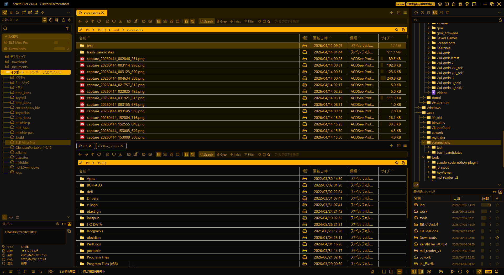
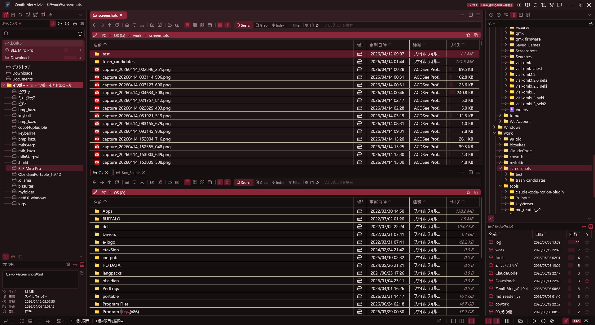
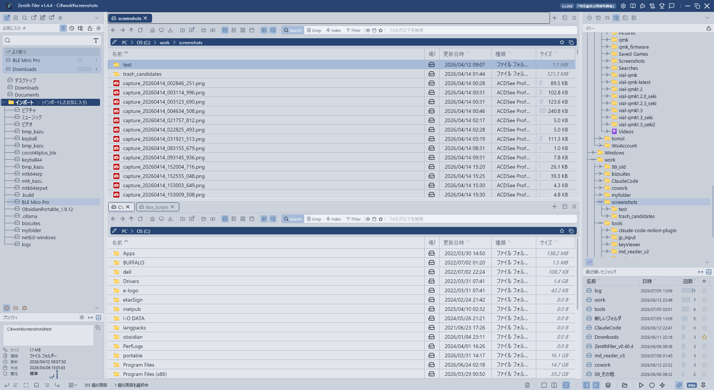
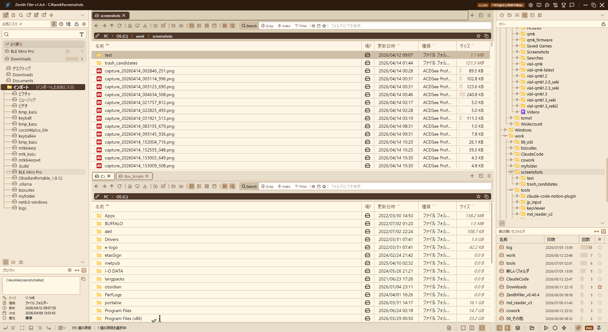
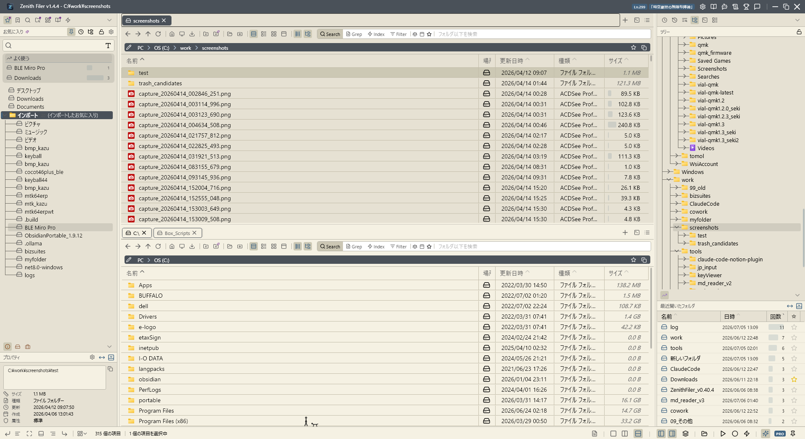
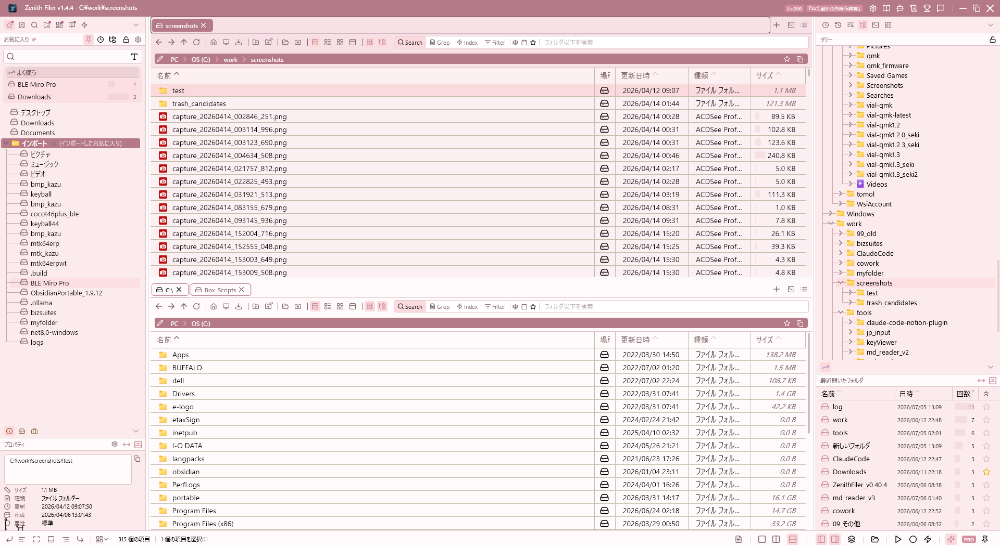
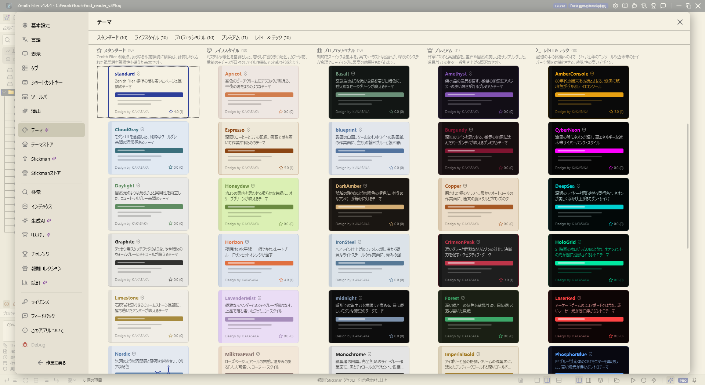
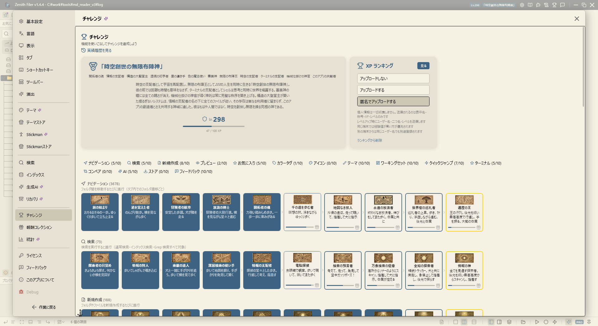
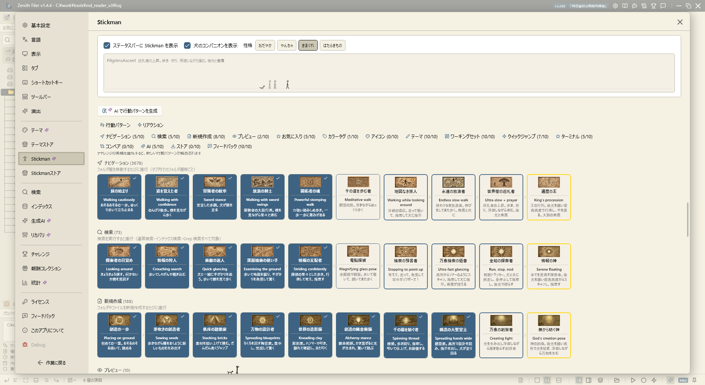
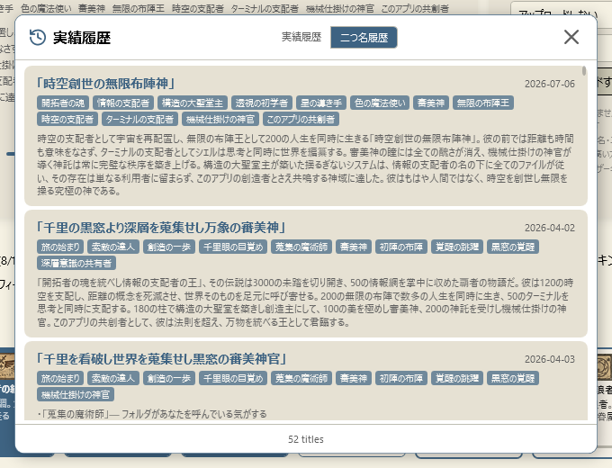

  

<h1 align="center">Zenith Filer</h1>

  <b>速くて、育てられる。Windows 用タブ型 2 ペインファイラー</b> 
  A fast, themeable dual-pane file manager for Windows — with an achievement system that grows as you use it.

  
  
  
  

  <a href="https://github.com/sulkyjp/zenithFiler_update/releases/latest"><b>⬇ ダウンロード（無料）</b></a>
  ・
  <a href="https://www.vector.co.jp/soft/winnt/util/se528637.html">Vector で入手</a>

---

## 3 行でわかる Zenith Filer

- ⚡ **速い** — 起動約 1 秒・全操作を非同期化。ウイルス対策ソフトで重い社用 PC でも軽快に動くよう実測ベースで最適化
- 🎨 **着せ替えられる** — 内蔵テーマ 50 種＋コミュニティストア＋AI テーマ生成。左右のペインに別テーマも
- 🏆 **育つ** — 使い込むほど実績 150 種が解除され、マスコット「Stickman」の行動レパートリーが増えていく

<table>
  <tr>
    <td></td>
    <td></td>
    <td></td>
  </tr>
  <tr>
    <td></td>
    <td></td>
    <td></td>
  </tr>
</table>

同じアプリ、別のテーマ — 内蔵 50 種からワンクリックで切替

<table>
  <tr>
    <td width="50%"></td>
    <td width="50%"></td>
  </tr>
</table>

左: 内蔵テーマ 50 種のカタログ　／　右: 使い込むほど解除される実績 150 種と AI が授ける「二つ名」

---

## Download

**[Latest Release をダウンロード](https://github.com/sulkyjp/zenithFiler_update/releases/latest)** — ZIP を展開するだけ。インストール不要

<!-- download-table:begin -->
| ファイル | 内容 |
|---|---|
| `ZenithFiler_v1.6.2.zip` | **完全版** — .NET ランタイム同梱。初回導入や環境移行に |
| `ZenithFiler_v1.6.2_patch.zip` | **軽量版** — ランタイム除外。既存環境のアップデートに |
| `ZenithFiler_v1.6.2_delta_from_1.6.1.zip` | **差分版** — 前バージョンから変更されたファイルのみ |
<!-- download-table:end -->

対応 OS: Windows 10 / 11 (x64)　|　導入後は差分自動アップデートで常に最新

## 無料版と Pro

すべての機能を**無料で試用できます**（一部機能に回数制限あり）。Pro ライセンスの購入で全機能が無制限になります。

**[Vector で Pro ライセンスを購入](https://www.vector.co.jp/soft/winnt/util/se528637.html)**（ダウンロードも可能）

---

## 主な機能

各項目をクリックで詳細表示

<b>🎨 テーマ — 内蔵 50 種・ストア・AI 生成</b>

| 機能 | 説明 |
|---|---|
| 50 テーマ内蔵 | 5 カテゴリ × 10（Standard / Lifestyle / Professional / Premium / RetroTech） |
| テーマストア | コミュニティ製テーマのダウンロード・評価・自作テーマの投稿 |
| AI テーマ生成 | 「夕暮れのサイバーパンク風」のような指示文からテーマを自動生成 |
| ペイン別テーマ | A / B / ナビペインに異なるテーマを適用可能 |
| カスタマイズ | 62 色キーを色単位で編集、非破壊保存 |
| ランダム / スケジュール | 起動ごとのランダム切替、昼夜での自動切替 |
| テーマ診断 | 6 問のアンケートでおすすめテーマを提案 |

<b>🏆 実績システム & Stickman マスコット</b>

| 機能 | 説明 |
|---|---|
| 実績 150 種 | 15 カテゴリ × 10 段階。日々のファイル操作で自然に解除 |
| XP・レベル・二つ名 | 操作の蓄積でレベルアップ。AI が「二つ名」と物語を生成 |
| Stickman | ステータスバーに住むマスコット。実績解除で行動レパートリーが増加 |
| Stickman ストア | コミュニティ製の行動パターンをダウンロード・投稿 |
| 実績のデバイス間共有 | 共有フォルダ経由で複数 PC の実績を統合 |

<b>🤖 AI 連携（任意・オフでも全機能利用可）</b>

| 機能 | 説明 |
|---|---|
| 対応プロバイダ | Claude / OpenAI / Azure OpenAI / Gemini / Ollama（ローカル LLM） |
| ファイル操作系 | AI リネーム、フォルダ整理提案、フォルダ自動作成、お気に入り整理 |
| 分析系 | 利用統計の AI 分析、タブ管理提案、バックアップ内容の要約 |
| 生成系 | テーマ生成、Stickman 行動生成、実績二つ名の生成 |
| AI マニュアル | 分厚いマニュアルを読まなくても、「〇〇するには？」と質問すれば AI がマニュアルを踏まえて回答 |

<b>⚙️ マクロ（JavaScript 自動化）</b>

| 機能 | 説明 |
|---|---|
| JavaScript エンジン | ファイル操作・ナビゲーションをスクリプトで自動化 |
| ナビペイン統合 | マクロ一覧ビューから即実行 |

<b>📁 ファイル管理（コア）</b>

| 機能 | 説明 |
|---|---|
| デュアルペイン | A（中央）/ B（右）の独立した 2 画面ファイルブラウザ |
| タブブラウジング | ペインごとに複数タブで別々のフォルダを表示 |
| 表示モード | 詳細リスト / 大アイコン / 中アイコン / 小アイコン |
| カラムソート | 名前・更新日・サイズ・拡張子で昇順/降順切替 |
| ファイル操作 | コピー / 移動 / 削除 / リネーム（F2）、操作の取り消し |
| ドラッグ＆ドロップ | ペイン間のファイル移動・コピー、右ドラッグで操作選択 |
| シェルサムネイル | 画像ファイルのサムネイル自動生成・キャッシュ |

<b>🧭 ナビゲーション & ナビペイン（6 ビュー）</b>

| ビュー / 機能 | 詳細 |
|---|---|
| お気に入り | ブックマーク、説明タグ、仮想フォルダ、検索、D&D 登録、TOP5 表示 |
| ディレクトリツリー | 全ドライブのツリー表示、遅延読込、リアルタイム同期 |
| 最近使ったファイル | 直近 100 件のアクセス履歴、回数・日時表示 |
| 参照履歴 | 日付グループ表示、キーワード検索 |
| インデックス検索設定 | 対象フォルダ管理、差分/完全再構築、進捗表示 |
| ターミナル | 埋め込みターミナル、複数タブ、A/B ペインパス連動、ANSI 256 色対応 |
| ブレッドクラムバー | 階層パスナビ＋フォルダドロップダウン、テキスト入力切替 |

<b>🔍 検索 — 全文検索・grep・プリセット</b>

| 機能 | 説明 |
|---|---|
| インデックス検索 | Lucene.NET + 日本語形態素解析による全文検索 |
| ファイル内容検索 | ripgrep エンジンによる高速 grep |
| 検索プリセット | ビルトイン 8 種＋ユーザー作成（今日更新・巨大ファイル・画像 等） |
| フィルタ | サイズ / 日付 / ファイル種別 |
| インデックス更新 | 自動（リアルタイム監視）/ 定期 / 手動、アイドル時のみ実行、エコモード |

<b>👁 クイックプレビュー</b>

| 対応形式 | 説明 |
|---|---|
| テキスト / コード | .txt, .json, .bat, .ps1 等のリアルタイムプレビュー |
| PDF / HTML / 画像 | ページ送り付き PDF、Web、jpeg/png/gif/webp 等 |
| Office | Excel / CSV（シート選択）、Word、PowerPoint |
| テキスト差分 | 2 ファイルの Diff 表示 |

<b>🎛 カスタマイズ — 設定・キーバインド・多言語</b>

| 機能 | 説明 |
|---|---|
| キーバインド | 25 以上のアクションを自由に変更、JSON エクスポート/インポート |
| エフェクト 12 カテゴリ | アニメーションを部位別に ON/OFF |
| 表示設定 | 行高 4 段階、拡張子・隠しファイル表示 |
| 10 言語対応 | 日英中（簡/繁）韓独西仏露葡、再起動なしで切替 |
| ワーキングセット | タブ構成・表示状態を丸ごと保存し、ワンクリック復元 |
| ナビペイン構成プリセット | サイドバーのビュー構成を名前付きで保存し、起動時に自動適用 |
| 設定バックアップ | 説明付きスナップショット、ワンクリック復元 |

<b>🖥 システム統合 — 常駐・スナップ・Box 連携</b>

| 機能 | 説明 |
|---|---|
| 自動アップデート | デルタ / パッチ / フルの 3 段階更新。再ダウンロード不要 |
| 常駐モード | タスクトレイ常駐、グローバルホットキーで即呼び出し |
| ウィンドウスナップ | 画面半分 ×4・4 分割 ×4 の 8 方向へワンタッチ配置 |
| ウィンドウ位置の記憶 | 終了時の位置・サイズを次回起動時に復元 |
| ウィンドウ配置プリセット | よく使う位置・サイズを名前付きで保存し、ワンクリック適用・起動時自動適用 |
| マルチディスプレイ保護 | 外部ディスプレイ切断でウィンドウが画面外に取り残された場合は自動レスキュー |
| Explorer 連携 | シェルコンテキストメニュー統合（独自メニューと切替可） |
| Box Drive 連携 | BOX:// パス検出、共有リンク取得、API 連携 |
| 統計 | 21 項目の操作カウント、閲覧フォルダランキング |
| 統合ドキュメント | マニュアル・変更履歴をアプリ内で閲覧（日英自動切替） |
| フィードバック送信 | 意見・要望・不具合報告をアプリ内から作者へ直接送信（アカウント登録不要） |
| エラー報告支援 | 不具合発生時はエラー内容が自動で整形された報告フォームが開き、そのまま送信可能 |

<b>📸 スクリーンショット集</b>

 
Stickman — 実績解除で行動レパートリーが増えていくマスコット 

  
AI が実績の組み合わせから生成する「二つ名」とその物語 

  
2 画面モード 

  
1 画面モード 

  
アプリ内からフィードバックを送信 

  
マニュアルページ（言語設定に連動して日英切替） 

  
独自コンテキストメニューとエクスプローラ互換メニュー 

  
自動アップデート 

<b>📋 最新の変更履歴</b>

<!-- latest-changes:begin -->
## Latest Changes — [1.6.2] - 2026-07-09 : リネーム後のフォーカス引き戻し・一覧選択時のペイン明滅・フィードバック入力の緩慢を修正

### Fixed
- **リネーム確定直後、約1秒後に元のファイルへフォーカス・選択が引き戻される問題を修正:** リネーム後の「新しい名前を選択する」意図が最大1.5秒間保持され続け、その間にFileSystemWatcher由来の後続の一覧更新（クラウド同期パスで約1秒後、ローカルで約0.5秒後に発生）が意図を再適用してしまい、ユーザーが既に別のファイルへ選択を移していても強制的に引き戻されていた。新しい名前のアイテムへの選択適用が完了した時点で意図を即座に消費するように変更し、後続の更新では引き戻しが起きないようにした。あわせて、一覧更新の開始後にユーザーがリスト上で操作していた場合は保存済み選択・フォーカスの復元をスキップする安全策と、2ペインで同一フォルダを表示している際に他ペインのフォーカスを誤って保存・奪取しないようにする修正も行った
- **フィードバック画面での文字入力が極端に緩慢になる問題を修正:** タイトル・説明欄への入力のたびに、画面右側のプレビュー表示を同期的に更新する処理が走っており、UIスレッドを占有してステータスバーのマスコットの動きまで巻き添えで緩慢になっていた。入力停止後0.3秒でまとめて反映する標準的なデバウンス方式に変更し、入力中の再描画コストをなくした。あわせて「直近のエラーログ」添付チェック時に行っていたログファイルの同期読み込みをバックグラウンド化し、チェック操作時の一時的なフリーズも解消した
- **一覧の選択を動かすたびにペイン全体が一瞬明滅（チカチカ）する問題を修正:** タブ切替時のコンテンツフェードイン演出が、ファイル一覧の選択変更イベントの伝播（バブリング）によって誤発火し、上下キーやクリックで選択を動かすたびにペイン全体（パンくず・ツールバー含む）へ透明度アニメーションが再生されていた。メインテーマとペイン個別テーマの明暗差が大きい構成（ライト系メインテーマ×ダーク系ペインテーマ等）では背後の明るい色が透けて特に目立っていた。演出の発火をタブ切替そのものに限定し、タブヘッダーのインジケータ演出にも同種の対策を適用した。選択移動ごとの無駄な再描画がなくなり、キーボード連打時の描画負荷も軽減される

> 過去の変更履歴は [Releases](https://github.com/sulkyjp/zenithFiler_update/releases) を参照してください。
<!-- latest-changes:end -->

---

  Developed by <a href="https://github.com/sulkyjp">sulkyjp</a> ・ <a href="https://github.com/sulkyjp/zenithFiler_feedback/issues">フィードバック・不具合報告</a>

