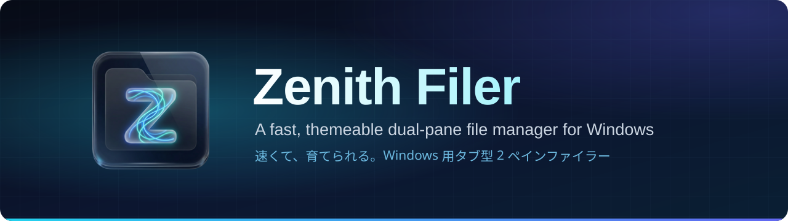
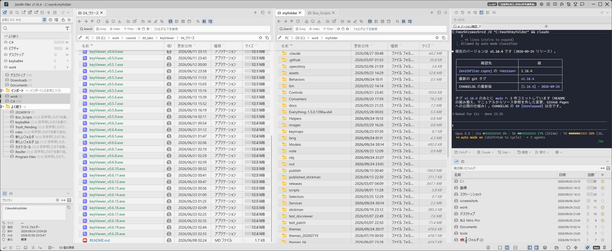

  

  
  
  
  
  

  
  &nbsp;
  

  

 

  <a href="#highlights"><b>Highlights</b></a> ·
  <a href="#download"><b>Download</b></a> ·
  <a href="#free--pro"><b>Free &amp; Pro</b></a> ·
  <a href="#features"><b>Features</b></a> ·
  <a href="https://sulkyjp.github.io/zenithFiler_update/"><b>Manual</b></a> ·
  <a href="#latest-changes"><b>Latest changes</b></a> ·
  <a href="#license"><b>License</b></a> ·
  <a href="#feedback"><b>Feedback</b></a>

## Highlights

<table>
  <tr>
    <td width="50%" valign="top">
      <h3>⚡ Fast</h3>
      Starts in about a second, and every operation runs asynchronously. Tuned on real measurements to stay responsive even on corporate PCs weighed down by antivirus software.
    </td>
    <td width="50%" valign="top">
      <h3>🧭 Never breaks your flow</h3>
      A ring launcher that opens around the cursor, a command palette that finds every action by name, and a shortcut for everything.
    </td>
  </tr>
  <tr>
    <td width="50%" valign="top">
      <h3>🖥 Terminal, macros &amp; AI inside</h3>
      Up to four ConPTY terminals that follow your folders, macros you build without code, and AI that can run fully locally with Ollama. Everything works with AI off.
    </td>
    <td width="50%" valign="top">
      <h3>🎨 Make it yours</h3>
      57 built-in themes, a community theme store, AI theme generation, and 150 achievements that unlock as you use it.
    </td>
  </tr>
</table>

<table>
  <tr>
    <td></td>
    <td></td>
    <td></td>
  </tr>
  <tr>
    <td></td>
    <td></td>
    <td></td>
  </tr>
</table>

Same app, different theme — switch with one click from 57 built-in themes

## Download

<!-- download-table-en:begin -->
| File | Description |
|---|---|
| `ZenithFiler_v1.17.0.zip` | **Full** — includes the .NET runtime. Best for first-time installs or moving to a new machine |
| `ZenithFiler_v1.17.0_delta_from_1.16.5.zip` | **Delta** — only the files that changed since the previous version |
<!-- download-table-en:end -->

> [!TIP]
> **No installer.** Unzip and run `ZenithFiler.exe`. Settings stay next to the app, so it runs from a USB stick too. Once installed, it keeps itself current with automatic delta updates.
> Supported OS: Windows 10 / 11 (x64).

## Free &amp; Pro

|  | Free | Pro |
|---|:---:|:---:|
| Browsing, file operations, terminal, themes, search | ✅ Unlimited | ✅ Unlimited |
| Exports, batch operations, folder sync, theme customization | Daily limit | ✅ Unlimited |
| Macros and AI features | Daily limit | ✅ Unlimited |

  

> [!NOTE]
> **$15, one-time, tax included.** Checkout is handled by [Polar](https://buy.polar.sh/polar_cl_u02Y6qn9QQJCPLre0LwBv58I8Ll2Cg7XYl7pj3PXcyt), which acts as the merchant of record. Your license key is emailed to you within 24 hours; enter it in Control Deck (`Ctrl+Shift+O`) → License.
> Buying from Japan? Use [Vector](https://www.vector.co.jp/soft/winnt/util/se528637.html) instead.

## Features

Click a category to expand it · Every feature is explained in the <a href="https://sulkyjp.github.io/zenithFiler_update/">online manual</a>

<b>🧭 Reach features without moving your hand</b>

| Feature | Description |
|---|---|
| Ring launcher | Press the left and right mouse buttons together and a ring of your 8 most-used actions opens around the cursor. Flick toward one and let go |
| Command palette | `Ctrl+Shift+P` finds and runs any action by name, description, or key — including actions with no shortcut bound |
| Keyboard shortcuts | Every action can be remapped, with JSON export and import. Shortcuts keep working during Japanese/IME input |
| Tabs and two panes | The A pane (center) and B pane (right), each with its own tabs. Single-pane mode is one click away |
| Working sets | Save an entire tab layout and restore it with one click |

<b>📁 File management</b>

| Feature | Description |
|---|---|
| File operations | Copy, move, delete, and rename with undo. Large copies and moves show a progress window with speed and time remaining, where each job can be paused or stopped |
| Drag and drop | Between panes and with other apps; right-drag to choose the action. Dropping onto a shortcut (.lnk) uses its target |
| Batch rename | Rename many files at once with a live preview |
| Batch timestamps & attributes | Change created/modified/accessed times and attributes of many items at once, previewing exactly what will change |
| Archives | Extract and compress ZIP and other formats from the right-click menu, including straight into the other pane |
| Folder compare & sync | Compare the folders in the A and B panes by size, time, or content hash, then sync A → B |
| Hash verification | Compute SHA-256 / SHA-1 / MD5 / CRC-32 and verify against a pasted value — the algorithm is detected automatically |
| FTP / SFTP / FTPS | Server folders open in a pane just like local ones |
| Phones and cameras | Browse MTP devices from the drive list |
| Thumbnails | Image and video thumbnails, freely resizable with `Ctrl+Wheel` |

<b>🖥 Built-in terminal — up to 4 panes, ConPTY</b>

| Feature | Description |
|---|---|
| A real shell | Runs cmd.exe or PowerShell through ConPTY, with correct ANSI 256-color and CJK character widths |
| Up to 4 at once | Four terminals can sit in the nav panes at the same time, each with its own working directory |
| Path sync | `cd` in the terminal moves the A or B pane with it; click a path in the output to open it in a pane |
| Shell integration | Persistent history with `Ctrl+R` search, jump between commands with `Ctrl+↑/↓`, input prediction, and error lines marked in red |
| Claude Code integration | Usage gauge, workspace picker, prompt history, and pasted images converted to file paths automatically |

<b>🤖 AI integration (optional — every feature works with it off)</b>

| Feature | Description |
|---|---|
| Providers | Claude / OpenAI / Azure OpenAI / Gemini / Ollama (local LLM) / Claude Code (CLI) |
| Fully local | With Ollama, nothing leaves your PC. Setup, model download, and server start/stop are handled by the app |
| File operations | AI-assisted renaming, folder organization suggestions, automatic folder creation, favorites cleanup |
| Analysis | Usage statistics analysis, tab-management suggestions, backup summaries |
| Generation | Themes, macros from a sentence, Stickman actions, and achievement titles |
| AI manual | Ask "how do I...?" and get an answer grounded in the manual |

<b>⚙️ Macros</b>

| Feature | Description |
|---|---|
| No-code building | Wire blocks together in Macro Studio, record your actual operations, or describe the macro in a sentence and let AI build it |
| JavaScript underneath | Full access to file operations and navigation through the `zen.*` API |
| Run your way | From the nav pane, the status bar, triggers, or repeatedly — and stop at any time |

<b>🧩 Nav panes — about 20 views</b>

| Feature | Description |
|---|---|
| Views | Favorites, directory tree (with Recycle Bin), recent files, browse history, search, sites (FTP/SFTP), macros, terminal, and more |
| Free layout | Put any view on either side, stack two views, or save the layout as a named preset |
| Detachable | Pop a view out into its own window and snap windows together |
| Automatic favorites | Folders you open often are suggested as favorites automatically |

<b>🔍 Search</b>

| Feature | Description |
|---|---|
| Indexed search | Full-text search powered by Lucene.NET, with Japanese morphological analysis |
| Content search | Fast grep powered by ripgrep |
| Presets and filters | 8 built-in presets plus your own; filter by size, date, and file type |
| Index updates | Real-time, scheduled, or manual; runs only when idle, with an eco mode |

<b>👁 Preview and compare</b>

| Feature | Description |
|---|---|
| Text and code | Live preview for .txt, .json, .bat, .ps1, and more |
| PDF / HTML / images | Paginated PDF, web pages, jpeg/png/gif/webp, and more |
| Office | Excel / CSV (with sheet selection), Word, PowerPoint |
| Text diff | Side-by-side comparison of two files |

<b>🎨 Themes</b>

| Feature | Description |
|---|---|
| 57 built-in themes | 5 categories: Standard / Lifestyle / Professional / Premium / RetroTech. The default, Plain, is white and light gray with no theme color |
| Theme store | Download and rate community themes, or submit your own |
| AI theme generation | Generate a theme from a prompt like "dusk cyberpunk vibes" |
| Per-pane themes | Give the A pane, B pane, and nav panes different themes |
| Customization | Edit any of 130 color keys; changes are saved separately and never overwrite the original |
| Random / schedule | A random theme on every launch, or automatic day/night switching |
| Fonts and icons | Set font and icon sizes per element |

<b>🏆 Achievements & the Stickman mascot</b>

| Feature | Description |
|---|---|
| 150 achievements | 15 categories × 10 tiers, unlocked naturally through everyday file operations |
| XP, levels, and titles | Level up as you work; AI writes you a title and a backstory |
| Stickman | A mascot living in the status bar that reacts to what you do. Its repertoire grows as you unlock achievements |
| Sync across PCs | Merge achievements from several PCs through a shared folder |

<b>🪟 System integration</b>

| Feature | Description |
|---|---|
| Automatic updates | Delta updates download only what changed |
| Background mode | Lives in the system tray and appears instantly with a global hotkey |
| Window snapping and presets | Snap to 8 layouts (halves and quarters), or save named positions and apply them on launch |
| Multi-monitor rescue | Brings the window back if a disconnected display leaves it off-screen |
| Explorer integration | The Windows context menu, including Windows 11-style entries — or the app's own menu |
| Box Drive | Detects Box paths and copies share links |
| 10 languages | English, Japanese, Chinese (Simplified/Traditional), Korean, German, Spanish, French, Russian, Portuguese — switch without restarting |
| Built-in manual | Per-feature manual and changelog inside the app |

<b>📸 Screenshots</b>

 
Stickman — a mascot whose repertoire grows as you unlock achievements 

  
The AI-generated title and backstory built from your achievements 

  
Two-pane mode 

  
Single-pane mode 

  
Sending feedback from inside the app 

  
The built-in manual (follows the language setting) 

  
The app's own context menu and the Explorer-compatible menu 

  
Automatic updates 

## Latest changes

<b>Show the notes for the latest release</b>

<!-- latest-changes-en:begin -->
**[1.17.0] - 2026-09-27 : Defaults for new users become quieter and closer to an ordinary file manager, the author's setup can be applied in one go, the toolbar's button count can be chosen, right-clicking a column header shows or hides columns, and the default Plain theme looks like File Explorer**

### Added

- **`Ctrl+I` now filters the current folder in place (#356)** — The search bar's Filter mode (which narrows the list of the folder you have open as you type) had no key of its own: you had to press `Ctrl+F` to reach the search box and then click the Filter button. Press `Ctrl+I` and the cursor lands in the active pane's search box in Filter mode, so you can just start typing. Clear the text with × or `Esc` to get the full list back. The key can be changed under Shortcut Keys in the Control Deck and works by default in every keymap. The Filter button's tooltip now shows the key, and the manual's Search Features article gained a section on Filter.

- **The pane toolbar's button count can now be chosen in the free version too, between "Fewer" and "Standard" (#357)** — Reordering and showing or hiding toolbar buttons is a Pro feature, so the free version was stuck with all 20 buttons. Under "Number of buttons" in Control Deck > Toolbar you can now pick "Fewer", with only the 9 buttons File Explorer also has, or "Standard", with every button. New users start with "Fewer".

- **The setup the author uses every day can now be applied in one go (#357)** — Now that the defaults for new users are quieter, you can get back to the author's setup with one click. "Author's setup" in Control Deck > General applies the nav pane layout (Author's Layout), every toolbar button, the level and title banners, AI / Pro badges, feature recommendations, the theme notification on startup and the default Ring Launcher layout together. It asks first, and if you have changed the Ring Launcher assignment without saving it anywhere, it tells you that assignment will be lost. XP ranking submission is not changed.

- **Right-click a column header in the list to show / hide columns and size them to fit (#361)** — As in File Explorer, right-clicking a column header offers "Size this column to fit", "Size all columns to fit" and a check for each column. Unchecked columns are hidden, and picking them again brings them back at their previous width. The Name column cannot be hidden. Hidden columns apply to the lists in every pane and tab and are kept after a restart. Search results show the same menu, where the Location, Path, Date Modified and Size columns can be hidden. Sizing columns to fit turns Adaptive columns off, just like double-clicking a header edge. Adaptive columns also now identifies columns by kind rather than by position, so the right columns are hidden even after you reorder them by dragging a header.

### Changed

- **Each row in "First 5 steps" now has a "How to" button that opens the steps for that action (#354)** — The old "Show me" only highlighted where to do it, and when that place was a small title bar button, as with the Command Palette, the highlight was easy to miss and it felt like nothing happened. "How to" opens three or four lines of steps below the card's heading, covering both the mouse and the keyboard, with the keys currently assigned in your keymap. Rows that have a place to show still highlight it for a few seconds, and pressing the button again hides the steps. Because the steps open below the heading rather than below the row, the five rows and their buttons stay where they are, so pressing again never lands on a different row. The × on the card also no longer closes it straight away: the card first asks whether to close, so an × pressed by mistake instead of Collapse can be taken back, and the way to bring the card back (Control Deck > General > Show "First 5 steps") is always shown. The last page of the setup before the first launch now mentions this too.

- **The first launch now starts with just the left nav pane and a single file pane** — Previously the left and right nav panes and Panes A and B were all on screen from the start, leaving each file list only about 400px wide at the default window size. On the first launch you now get the left nav pane and one file list. The right nav pane and Pane B are there when you want them, from the status bar buttons and elsewhere. **Nothing changes for people already using the app.** The "Standard" nav pane layout preset now matches this starting point and leaves the right nav pane closed (the views placed on it are the same as before and are there when you open it). The "Move files by drag and drop" item in "First 5 steps" now describes dragging onto a folder in the list or the address bar, which works with a single pane.

- **"First 5 steps" now appears right after the app starts (#354)** — On the first launch the card waited for the startup animation (about 10 seconds) to finish and then another 3 seconds, so it took around 13 seconds to show up. It no longer waits for the animation and appears one or two seconds after the window. On the first launch the startup "theme applied" notification is no longer shown either (you have just picked the theme, and it would be hidden behind the card).

- **The default Ring Launcher layout now has Quick Jump instead of Terminal at the lower right** — Quick Jump, which jumps across favorites, history and frequent folders, gets used far more often than the terminal. **If you have never changed your ring assignments, the lower right slot becomes Quick Jump.** To keep the terminal on the ring, assign it to any slot in the Ring Launcher settings in the Control Deck. Rings you have customized are left as they are. The "8 items" preset uses the same layout.

- **The default Plain theme now looks plain enough to pass for Windows File Explorer (#360)** — Plain was meant as an unadorned basic theme, but some of this app's own touches remained: list grid lines and selection outlines, light lines and shadows along the title bar and toolbars, and custom-shaped minimize / maximize / close buttons. With Plain, these are no longer drawn. The list has no grid lines, and the selected and hovered rows use the same pale blue as Windows, without an outline. The title bar is a light gray, and minimize / maximize / close are flat buttons like Windows (close turns red on hover). The bold text and underline bar on the active tab, and the glow around the focused search box, are gone too. Text weight and the steps between surfaces are brought as close to File Explorer as the readability standards allow. **If you use Plain, it will look different from the next version.** Other themes are unchanged. Also fixed: the hover color in the tab list did not follow the theme, and in the right-drag menu the hovered item's text vanished as white on white with Plain.

- **Defaults for new users are now quieter and closer to an ordinary file manager (#357)** — Until now, a fresh install anonymously sent data to the XP ranking, suggested features every few minutes, showed a "theme applied" notification on every launch, displayed the level and title banners in the title bar and the AI / Pro dots in the nav pane, and split the left nav pane into two tiers with Properties below Favorites. Anyone who goes through the setup shown before the first launch now starts like this: nothing is sent to the XP ranking (you can opt in under XP Ranking in Control Deck > Challenges); feature suggestions, the launch notification, the level and title banners and the AI / Pro dots are off (feature suggestions can be turned on in the Properties settings, the rest under General and Display in the Control Deck); the toolbar shows only the 9 buttons File Explorer also has (Back, Forward, Up, Refresh, New Folder, three view buttons and Sort); and the left nav pane's icon bar is trimmed to the 7 views an ordinary file manager has (Favorites, Tree, History, Recent Files, Drives, Index Search and Properties), starting as a single tier showing Favorites. **Settings of people already using the app do not change.** The "Standard" nav pane layout preset now matches this starting point, with a single-tier left nav pane of 7 icons.

- **Opening a view that is not on either icon bar, by key or from the Command Palette, now adds it to the left icon bar (#357)** — Previously, trying to open a view that was not placed on either icon bar (Macros, Preview, Tab List and so on) with a key, the Command Palette or the Ring Launcher did nothing. It is now added to the end of the left icon bar and opened. The left nav pane for new users has only 7 icons, so the other views can be added this way or from `∨` at the right end of the icon bar → "Edit All Pane Slots".

### Fixed

- **The manual's shortcut list named pane-split keys that were never bound (#355)** — It said "`Ctrl+1` for single pane, `Ctrl+2` for side-by-side, `Ctrl+Shift+2` for top-bottom", but `Ctrl+1` and `Ctrl+2` have never been bound, and `Ctrl+Shift+2` switches the sidebar to Tree View. The actual keys are `Ctrl+Shift+Q` for single pane, `Ctrl+Shift+W` for side-by-side and `Ctrl+3` for top-bottom (with the "Zenith 2" keymap, `Ctrl+B` followed by `1` / `2` / `3`). The shortcut list and the file pane article now match. The earlier release note that added `Ctrl+3` and said "`Ctrl+1` and `Ctrl+2` have always been there" was wrong as well.

- **The nav pane icon bar's "≫" for views that do not fit was missing right after launch (#353)** — The **≫** that should appear at the right end when the icons do not fit was missing when the app started, and only showed up after resizing the nav pane or picking a layout preset again. When ≫ appeared, the row of buttons at the right end did not widen to make room, so ≫, being first in that row, was pushed out of view. It now shows from the moment the app starts. The lower icon bar behaves the same way.

- **If the app quit before "First 5 steps" appeared, the card never showed again (#354)** — If the app quit before the card appeared on the first launch, the next launch no longer counted as the first one, so the card never appeared. The state is now recorded as soon as the card is scheduled, so it shows on the next launch even if the app quit before it appeared. The "Try the Ring Launcher" description now says "Press the left and right mouse buttons together…", and "How to" no longer highlights the unrelated pane A (the Ring Launcher can be opened anywhere, so there is no place to highlight).

- **Switching the language while "First 5 steps" was open left the card in the old language (#354)** — Only the button labels changed; the heading and each item's description stayed in the previous language. The heading, descriptions, steps and key labels now switch to the new language right away, and your progress and any open steps are kept.

- **Some screens could not be closed with Esc when using only the keyboard (#358)** — The confirmation dialog, the pose picker, theme customization (including its color picker), the search scope and search preset popups, and the terminal's key list, settings and color picker popups did not close on Esc. They all do now (the color picker restores the color it opened with). The Ring Launcher and the "What's new" card, which never take keyboard focus, also close when you press Esc in the main window. The Ring Launcher closes on Esc even while you are typing in a terminal, and pressing its shortcut again closes it too. Esc pressed during Japanese input conversion is handled correctly. Holding `Ctrl` and `Shift` while pressing Esc opens the Windows Task Manager, so the app never sees that combination. "First 5 steps", Macro Studio and the setup shown before the first launch intentionally do not close on Esc, so they are not dismissed by accident.

- **Text and icons in the nav pane that blended into the background (#359)** — In many themes, four spots were nearly the same color as what was behind them: the expand arrow on top-level groups in Favorites, the text and icons inside the "Frequent" and "Recently added" boxes above Favorites, the selected icon in the nav pane's lower icon bar, and the Pro lock in nav pane headings. They are now drawn in text colors that pair with their backgrounds. The selected icon in the lower icon bar also kept the color of the theme the app started with and did not follow theme changes; that is fixed too. The Pro lock now appears as a small badge, like the other PRO labels.

- **The manual's Settings Reference showed the video thumbnail download folder garbled as `datafmpeg\`** — It is `data\ffmpeg\`. Part of the path had turned into a form-feed character when it was written. The Japanese manual had the same problem.

- **In languages other than Japanese, the Size column header had too little room on its right (#361)** — The Size header keeps extra room on the right for the sort arrow, but it decided this by checking whether the header text was the Japanese word for "Size", so in English and other languages the room was not kept and the arrow could overlap the text. It now checks the kind of column instead (search results too).

> See [Releases](https://github.com/sulkyjp/zenithFiler_update/releases) for the full history.
<!-- latest-changes-en:end -->

## License

Zenith Filer is **proprietary software, not open source**. © 2024-2026 K.AKASAKA. All rights reserved.

- Free to download and try. **Personal and commercial use** are both allowed
- **One license key per person** — install it on the devices you use yourself, one at a time
- Redistribution, resale, and reverse engineering are not permitted

Read the full terms in the [EULA](EULA_en.md) · Summary: [LICENSE](LICENSE.md)

Windows is a trademark of the Microsoft group of companies. Claude, OpenAI, Azure, Gemini, Ollama, Box, and other product and company names mentioned are trademarks or registered trademarks of their respective owners. Zenith Filer is an independent product and is not affiliated with or endorsed by them.

## Feedback

> [!IMPORTANT]
> Please send requests and bug reports from **inside the app: Settings → Feedback**. No account is needed. This repository only hosts the release files and is not monitored as a support channel.

- **Replies reach you in the app**, under *Feedback history*
- **When a fix ships, the app asks whether it worked**, so a report is followed through to the end

<a href="#japanese">日本語のご案内へ ↓</a>

 

  <a href="#ja-highlights"><b>特長</b></a> ·
  <a href="#ja-download"><b>ダウンロード</b></a> ·
  <a href="#ja-pro"><b>無料版と Pro</b></a> ·
  <a href="#ja-features"><b>主な機能</b></a> ·
  <a href="https://sulkyjp.github.io/zenithFiler_update/ja/"><b>マニュアル</b></a> ·
  <a href="#ja-changes"><b>最新の変更履歴</b></a> ·
  <a href="#ja-license"><b>ライセンス</b></a> ·
  <a href="#ja-feedback"><b>フィードバック</b></a>

## 特長

<table>
  <tr>
    <td width="50%" valign="top">
      <h3>⚡ 速い</h3>
      起動は約 1 秒、すべての操作を非同期で処理。ウイルス対策ソフトで重い社用 PC でも軽快に動くよう、実測にもとづいて最適化しています。
    </td>
    <td width="50%" valign="top">
      <h3>🧭 手を止めずに届く</h3>
      カーソルのまわりに開くリングランチャー、名前で全機能を探せるコマンドパレット、すべての操作に割り当てられるショートカット。
    </td>
  </tr>
  <tr>
    <td width="50%" valign="top">
      <h3>🖥 ターミナル・マクロ・AI が中にある</h3>
      フォルダに追従する ConPTY ターミナルを最大 4 面、コードを書かずに作れるマクロ、Ollama なら完全ローカルで動く AI。AI をオフにしても全機能そのまま使えます。
    </td>
    <td width="50%" valign="top">
      <h3>🎨 育てられる</h3>
      内蔵テーマ 57 種、コミュニティのテーマストア、AI によるテーマ生成、使い込むほど解除される実績 150 種。
    </td>
  </tr>
</table>

## ダウンロード

<!-- download-table-ja:begin -->
| ファイル | 説明 |
|---|---|
| `ZenithFiler_v1.17.0.zip` | **完全版** — .NET ランタイム同梱。初回導入や環境移行に |
| `ZenithFiler_v1.17.0_delta_from_1.16.5.zip` | **差分版** — 前バージョンから変更されたファイルのみ |
<!-- download-table-ja:end -->

> [!TIP]
> **インストール不要。** ZIP を展開して `ZenithFiler.exe` を起動するだけです。設定はアプリの隣に保存されるので、USB メモリからも使えます。導入後は差分の自動アップデートで最新に保たれます。
> 対応 OS: Windows 10 / 11（x64）

## 無料版と Pro

|  | 無料版 | Pro |
|---|:---:|:---:|
| 閲覧・ファイル操作・ターミナル・テーマ・検索 | ✅ 無制限 | ✅ 無制限 |
| 書き出し・一括処理・フォルダ同期・テーマのカスタマイズ | 1 日の回数制限 | ✅ 無制限 |
| マクロ・AI 機能 | 1 日の回数制限 | ✅ 無制限 |

> [!NOTE]
> **Pro ライセンスは [Vector](https://www.vector.co.jp/soft/winnt/util/se528637.html) で購入できます**（Vector からのダウンロードも可能です）。

## 主な機能

| 分野 | できること |
|---|---|
| 🧭 手を止めずに届く | リングランチャー（左右ボタン同時押し）、コマンドパレット（`Ctrl+Shift+P`）、全操作のキー割り当て、ワーキングセット |
| 📁 ファイル管理 | 取り消し付きのファイル操作と進捗ウィンドウ、一括リネーム、日時・属性の一括変更、書庫の展開・圧縮、フォルダ比較・同期、ハッシュ照合、FTP / SFTP / FTPS、スマホ・カメラの閲覧、画像・動画サムネイル |
| 🖥 内蔵ターミナル | ConPTY で最大 4 面、ペインとのパス連動、コマンド履歴の検索、Claude Code 連携 |
| 🤖 AI 連携 | Claude / OpenAI / Azure OpenAI / Gemini / Ollama / Claude Code。AI リネーム、フォルダ整理、文章からのマクロ生成、AI マニュアル |
| ⚙️ マクロ | Macro Studio のブロック組み立て・操作の記録・文章からの生成。中身は JavaScript |
| 🧩 ナビペイン | 約 20 のビューを好きな位置へ、2 段重ね、別ウィンドウへの切り離し、よく開くフォルダの自動お気に入り |
| 🔍 検索 | Lucene.NET と日本語形態素解析による全文検索、ripgrep による内容検索、プリセットとフィルタ |
| 👁 プレビュー | テキスト・コード、PDF、HTML、画像、Excel / CSV / Word / PowerPoint、テキスト差分 |
| 🎨 テーマ | 内蔵 57 種（既定はテーマカラーを持たない Plain）、テーマストア、AI 生成、ペイン別テーマ、130 色キーの編集 |
| 🏆 実績と Stickman | 実績 150 種、XP・レベル・AI が授ける二つ名、操作に反応するマスコット |
| 🪟 システム統合 | 差分自動アップデート、タスクトレイ常駐、ウィンドウスナップと配置プリセット、Explorer のメニュー、Box Drive、10 言語 |

各機能の詳細は、<a href="https://sulkyjp.github.io/zenithFiler_update/ja/">オンラインのマニュアル</a>（アプリ内のマニュアルと同じ内容）をご覧ください。

## 最新の変更履歴

<b>最新リリースの内容を表示</b>

<!-- latest-changes-ja:begin -->
**[1.17.0] - 2026-09-27 : はじめて使う方の既定を普通のファイラーに近い控えめなものにし、作者の環境をまとめて当てる入口とツールバーのボタンの数の選択を加え、一覧の列見出しの右クリックで列の表示・非表示を選べるようにし、既定のテーマ Plain をエクスプローラーに寄せた**

### Added

- **`Ctrl+I` で、表示中のフォルダをその場で絞り込めるようにしました (#356)** — 検索バーの Filter（打った文字で今のフォルダの一覧を絞り込むモード）には、これまでキーが無く、`Ctrl+F` で検索欄に入ってから Filter ボタンを押す必要がありました。`Ctrl+I` を押すと、アクティブなペインの検索欄にカーソルが入って Filter モードになり、そのまま打てば一覧が絞り込まれます。× か `Esc` で文字を消すと元に戻ります。キーは Control Deck の「ショートカットキー」で変えられ、どのキーマップでも既定で使えます。Filter ボタンのツールチップにもキーを載せ、マニュアルの「検索機能」に Filter の説明を足しました。

- **ペインのツールバーのボタンの数を、無料版でも「少ない」と「標準」から選べるようにしました (#357)** — ツールバーの並べ替えや表示の切り替えは Pro 版の機能で、無料版では 20 個のボタンをそのまま使うしかありませんでした。Control Deck ＞ ツールバー の「ボタンの数」で、エクスプローラーにもある 9 個だけの「少ない」と、全部のボタンの「標準」を選べます。はじめて使う方は「少ない」で始まります。

- **作者がふだん使っている環境を、まとめて当てられるようにしました (#357)** — はじめて使う方の既定を控えめにしたぶん、作者の環境へワンタッチで戻せるようにしました。Control Deck ＞ 基本設定 の「作者のおすすめ」を押すと、ナビペインの配置（作者構成）、ツールバーの全部のボタン、レベルと二つ名のバナー、AI / Pro バッジ、機能推薦、起動時のテーマ適用通知、リングランチャーの既定の配置をまとめて当てます。当てる前に確かめ、リングランチャーの割り当てを自分で変えていてどこにも保存していないときは、失われることも知らせます。XP ランキングへの送信は変えません。

- **一覧の列見出しを右クリックして、列の表示・非表示と幅の自動調整を選べるようにしました (#361)** — エクスプローラーと同じく、列見出しの右クリックで「この列の幅を自動調整」「すべての列の幅を自動調整」と、列ごとの表示のチェックが出ます。チェックを外した列は隠れ、もう一度選ぶと元の幅で戻ります。名前の列は外せません。隠した列はすべてのペイン・タブの一覧に効き、起動し直しても残ります。検索結果の一覧でも同じメニューが出て、場所・パス・更新日時・サイズの列を隠せます。幅の自動調整を使うと、見出しの端をダブルクリックしたときと同じくアダプティブ列はオフになります。あわせて、アダプティブ列が列を位置の順番で扱っていたのを列の種類で見分けるようにし、見出しをドラッグして列を並べ替えても正しい列が隠れるようにしました。

### Changed

- **「はじめの 5 つ」の各行のボタンを［やり方］にし、押すとその操作の手順が開くようにしました (#354)** — これまでの［やってみる］は操作する場所を光らせるだけで、コマンドパレットのようにタイトルバーの小さなボタンが光っても気づけず、「押しても何も起きない」と感じることがありました。［やり方］を押すと、カードの見出しの下にその操作の手順が 3〜4 行で開きます。マウスでの操作とキーボードでの操作の両方を書いており、キーは今のキーマップで割り当たっているものを表示します。操作する場所がある項目は、これまでどおり数秒だけ光ります。もう一度押すと閉じます。手順は行の下ではなく見出しの下に開くので、開いても 5 つの行とボタンの位置は動かず、続けて押しても別の行を押してしまうことはありません。あわせて、カードの × を押したときは、すぐには閉じず「閉じますか？」とカードの上で確かめるようにしました。畳むつもりで隣の × を押してしまっても戻れて、閉じたあとの出し直し方（Control Deck ＞ 基本設定 の「『はじめの 5 つ』を表示」）も必ず目に入ります。起動前の設定画面の最後のページにも、この出し直し方を書き足しました。

- **はじめて起動したときの画面を、左のナビペインと 1 画面だけにしました** — これまでは左右のナビペインと A・B の 2 画面が最初から並び、既定の幅ではファイル一覧が 1 画面あたり 400px ほどしか取れませんでした。はじめて起動したときは、左のナビペインとファイル一覧 1 画面だけで始まります。右のナビペインと B ペインは、使いたくなったときにステータスバーのボタンなどから出せます。**すでに使っている方の画面は変わりません。** ナビペイン配置プリセットの「標準」も、この初期状態にそろえて右のナビペインを閉じた状態にしました（右のナビペインに並ぶビューはこれまでどおりで、開けば使えます）。あわせて「はじめの 5 つ」の「ドラッグ＆ドロップで移す」の説明を、1 画面でもできる「一覧のフォルダやアドレスバーへドラッグ」に書き直しました。

- **「はじめの 5 つ」が、起動してすぐに出るようにしました (#354)** — はじめて起動したときは、起動の演出（約 10 秒）が終わるのを待ってからさらに 3 秒おいて出していたため、カードが出るまで 13 秒ほどかかっていました。演出の終わりを待たず、画面が出てから 1〜2 秒で出します。はじめて起動したときは、起動時の「テーマを適用しました」のお知らせも出しません（テーマは直前に自分で選んだばかりで、カードの下に隠れてしまうため）。

- **リングランチャーの既定の配置で、右下を「ターミナル」から「クイックジャンプ」に替えました** — お気に入り・履歴・よく使うフォルダを横断して飛べるクイックジャンプのほうが、ターミナルより出番が多いためです。**リングの割り当てを自分で変えていない方は、右下がクイックジャンプに替わります。** ターミナルを使いたい場合は、Control Deck のリングランチャーの設定で好きな枠に割り当て直せます。自分で割り当てを変えている方のリングは変わりません。プリセットの「8 項目」も同じ並びになりました。

- **既定のテーマ Plain を、Windows のエクスプローラーと見間違えるくらい素の見た目にしました (#360)** — Plain は飾りのない基本のテーマとして用意しましたが、一覧の罫線や選択の枠、タイトルバーとツールバーの上に入る光の線や影、独自の形の最小化・最大化・閉じるボタンなど、このアプリらしい癖が残っていました。Plain を使っているときは、これらを描かないようにしました。一覧は罫線を引かず、選んだ行と指している行は Windows と同じ淡い青（枠なし）で示します。タイトルバーは明るいグレーになり、最小化・最大化・閉じるは Windows と同じ平らなボタンになります（閉じるは指すと赤）。アクティブなタブの太字と下のバー、検索欄の光る縁取りもなくしました。文字の濃さや面の段差は、読みやすさの基準を保てる範囲でエクスプローラーに寄せています。**Plain を使っている方は、次の版から見た目が変わります。** ほかのテーマの見た目は変わりません。あわせて、タブの一覧でタブを指したときの色がテーマに合っていなかったのと、右ドラッグのメニューで指した項目の文字が Plain で白い面に白く消えていたのを直しました。

- **はじめて使う方の既定を、普通のファイラーに近い控えめなものにしました (#357)** — これまでは最初から、XP ランキングへの匿名での送信、数分おきに出る機能のおすすめ、起動のたびの「テーマを適用しました」のお知らせ、タイトルバーのレベルと二つ名のバナー、ナビペインの AI・Pro の印の点が有効で、左のナビペインはお気に入りの下にプロパティが並ぶ 2 段でした。はじめて起動したときの設定画面を通った方は、次の状態で始まります。XP ランキングへは送信しません（Control Deck ＞ チャレンジ の「XP ランキング」で自分から選べます）。機能のおすすめ・起動時のお知らせ・レベルと二つ名のバナー・AI と Pro の印の点は出しません（機能のおすすめはプロパティの設定から、そのほかは Control Deck の基本設定と表示から出せます）。ツールバーは、エクスプローラーにもある 9 個のボタン（戻る・進む・上へ・更新・新しいフォルダ・表示の切り替え 3 つ・並べ替え）だけにします。左のナビペインは、アイコンを普通のファイラーにある 7 つ（お気に入り・ツリー・履歴・最近開いたファイル・ドライブ・インデックス検索・プロパティ）に絞り、お気に入りだけの 1 段で始めます。**すでに使っている方の設定は変わりません。** ナビペイン配置プリセットの「標準」も、この初期状態にそろえて左のナビペインを 7 つのアイコンの 1 段にしました。

- **アイコンバーに無いビューをキーやコマンドパレットで開いたとき、左のアイコンバーに足して開くようにしました (#357)** — これまでは、左右どちらのアイコンバーにも置いていないビュー（マクロ・プレビュー・タブ一覧など）を、キーやコマンドパレット、リングランチャーから開こうとしても何も起きませんでした。いまは左のアイコンバーの末尾に足してから開きます。はじめて使う方の左のナビペインはアイコンを 7 つに絞ったので、ほかのビューもこの方法か、アイコンバー右端の `∨` →「ペイン配置をまとめて編集」から足せます。

### Fixed

- **マニュアルのショートカット一覧に、割り当てのない画面分割のキーが載っていたのを直しました (#355)** — 「`Ctrl+1` で 1 画面、`Ctrl+2` で左右 2 画面、`Ctrl+Shift+2` で上下 2 画面」と案内していましたが、`Ctrl+1` と `Ctrl+2` は一度も割り当てたことがなく、`Ctrl+Shift+2` はサイドバーをツリービューに切り替えるキーでした。実際のキーは、1 画面が `Ctrl+Shift+Q`、左右 2 画面が `Ctrl+Shift+W`、上下 2 画面が `Ctrl+3` です（キーマップ「Zenith 2」では `Ctrl+B` に続けて `1`／`2`／`3`）。ショートカット一覧とファイルペインの記事をこれに合わせました。以前の更新履歴で `Ctrl+3` を足したときに「`Ctrl+1`・`Ctrl+2` は前からありました」と書いたのも誤りです。

- **はじめて起動したとき、ナビペインのアイコンバーに入りきらないビューの「≫」が出なかったのを直しました (#353)** — アイコンが入りきらないときに右端に出るはずの **≫** が、起動した直後は欠けていて、ナビペインの幅を変えるか配置プリセットを選び直すまで現れませんでした。≫ が現れたときに右端のボタンの並びが広がらず、先頭の ≫ だけがはみ出して隠れていたためです。起動した直後から ≫ が出るようにしました。下段のアイコンバーも同じです。

- **「はじめの 5 つ」が出る前にアプリが終了すると、次からカードが出なくなっていたのを直しました (#354)** — はじめて起動したとき、カードが出る前にアプリが終了すると、次の起動はもう「初回」ではないため、カードが二度と出ませんでした。カードを出す準備をした時点で状態を記録するようにしたので、カードが出る前に終了しても、次の起動で表示されます。あわせて、「リングランチャーを使う」の説明を「マウスの左右のボタンを同時に押すと…」と書き直し、［やり方］で関係のない A ペインが光っていたのをやめました（リングランチャーは画面のどこでも出せるので、光らせる場所がありません）。

- **「はじめの 5 つ」を出したまま言語を切り替えると、カードの中身が元の言語のまま残っていたのを直しました (#354)** — ボタン名だけが切り替わり、題や各項目の説明は前の言語のままでした。言語を切り替えると、題・説明・手順・キーの表示まで、その場で新しい言語に変わります。チェックの進み具合や開いている手順はそのままです。

- **キーボードだけで使っているとき、Esc で閉じられない画面があったのを直しました (#358)** — 確認のダイアログ、ポーズの選択、テーマのカスタマイズ（中の色選択も）、検索スコープと検索プリセットのポップアップ、ターミナルのキー一覧・設定・色選択のポップアップが、Esc では閉じられませんでした。いずれも Esc で閉じるようにしました（色選択は開いた時点の色に戻して閉じます）。フォーカスを持たない作りのリングランチャーと更新のお知らせも、本体で Esc を押せば閉じます。リングランチャーは、ターミナルに文字を打っている最中でも Esc で閉じられ、呼び出しキーをもう一度押しても閉じます。日本語入力の変換中の Esc も正しく判定します。なお、`Ctrl` と `Shift` を押したまま Esc を押すと Windows のタスクマネージャーが開くため、アプリは受け取れません。「はじめの 5 つ」・マクロスタジオ・起動前の設定画面は、誤って閉じないよう Esc では閉じません。

- **ナビペインで、文字やアイコンが背景に溶けて読めない箇所を直しました (#359)** — 多くのテーマで、次の 4 か所が背景とほぼ同じ色になっていました。お気に入りのいちばん上のグループの行の開閉の矢印、お気に入りの上に出る「よく使う」「最近追加」の枠の中の文字とアイコン、ナビペインの下段のアイコンバーで選んでいるアイコン、ナビペインの見出しに出る Pro の錠前。どれも、背景の色と対になる文字の色で描くようにしました。下段のアイコンバーの選択中のアイコンは、アプリを起動したときのテーマの色のまま残り、テーマを切り替えても変わっていなかったのも直しています。Pro の錠前は、ほかの PRO 表示と同じ小さなバッジの形にしました。

- **マニュアルの「設定リファレンス」で、動画のサムネイル用の取り込み先が `datafmpeg\` と崩れて表示されていたのを直しました** — 正しくは `data\ffmpeg\` です。書いたときにパスの一部が改ページの文字に化けていました。英語版も同じです。

- **日本語以外の表示で、サイズの列見出しの右の余白が狭かったのを直しました (#361)** — サイズの列見出しは、右に並べ替えの矢印ぶんの余白を取っていますが、見出しの文字が「サイズ」かどうかで判定していたため、英語などほかの言語では余白が取られず、矢印が文字に重なることがありました。列の種類で判定するようにしました（検索結果の一覧も同じです）。

> 過去の変更履歴は [Releases](https://github.com/sulkyjp/zenithFiler_update/releases) を参照してください。
<!-- latest-changes-ja:end -->

## ライセンス

Zenith Filer は**著作者が権利を持つ商用ソフトウェアで、オープンソースではありません**。© 2024-2026 K.AKASAKA. All rights reserved.

- 無料でダウンロードして試せます。**個人でも仕事でも**使えます
- **ライセンスキーは 1 人に 1 本**。自分で使う PC に入れられ、同時に使うのは 1 台までです
- 再配布・転売・リバースエンジニアリングは禁止です

全文は[使用許諾契約書（EULA）](EULA_ja.md)、要約は [LICENSE](LICENSE.md) をご覧ください。

Windows は Microsoft グループの商標です。Claude・OpenAI・Azure・Gemini・Ollama・Box など、記載の製品名・会社名は各社の商標または登録商標です。Zenith Filer は独立した製品であり、これらの会社と提携しておらず、推奨も受けていません。

## フィードバック

> [!IMPORTANT]
> 要望・不具合は、**アプリ内の「設定 → フィードバック」**からお送りください。アカウント登録は不要です。このリポジトリは配布物を置くためだけのもので、問い合わせ窓口ではありません。

- 作者からの回答が**アプリ内の「フィードバック履歴」に届きます**
- 修正版が出ると「直った／まだ直っていない」を知らせるボタンが出るので、**最後まで追えます**

<a href="#english">↑ Back to English</a>

---

  © 2024-2026 K.AKASAKA · <a href="LICENSE.md">License</a> · <a href="https://github.com/sulkyjp">sulkyjp</a> · <a href="#english">English</a> · <a href="#japanese">日本語</a>

