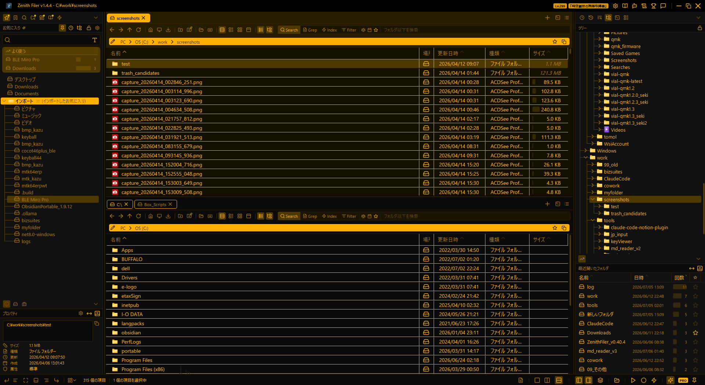
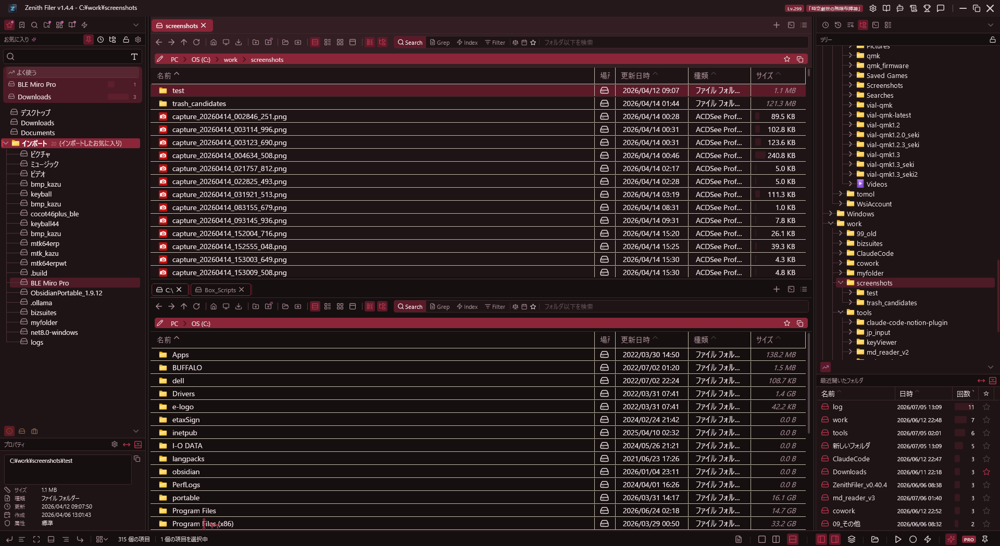
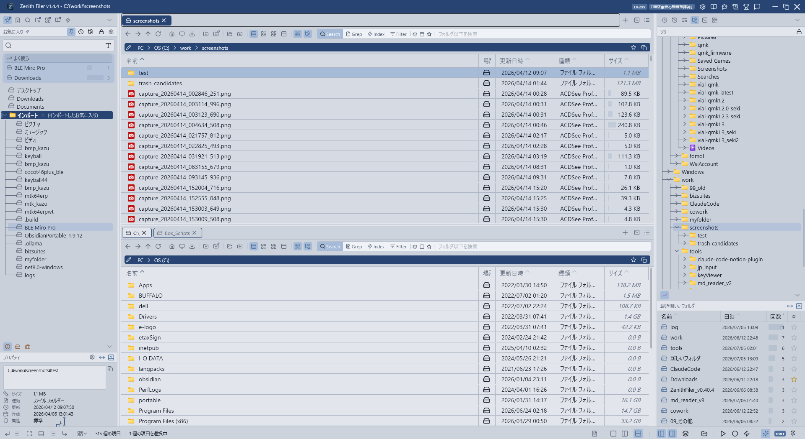
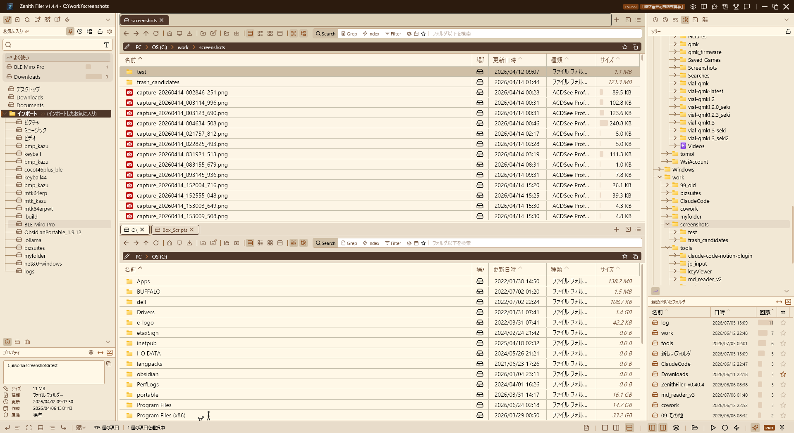
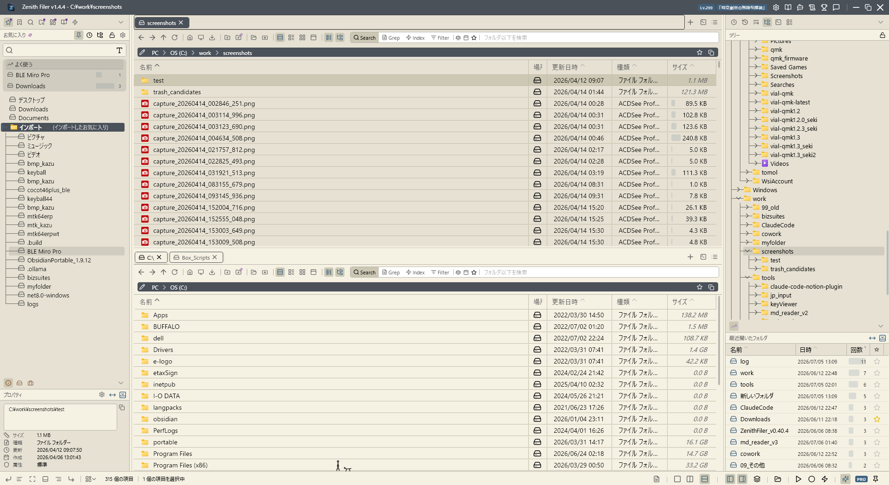
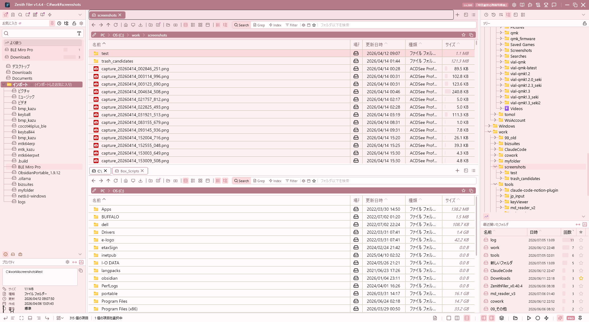
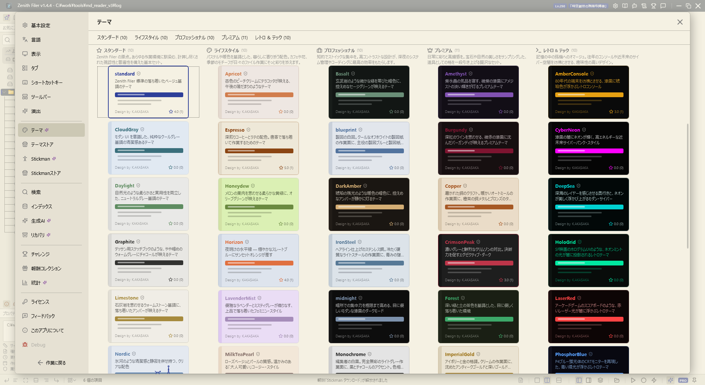
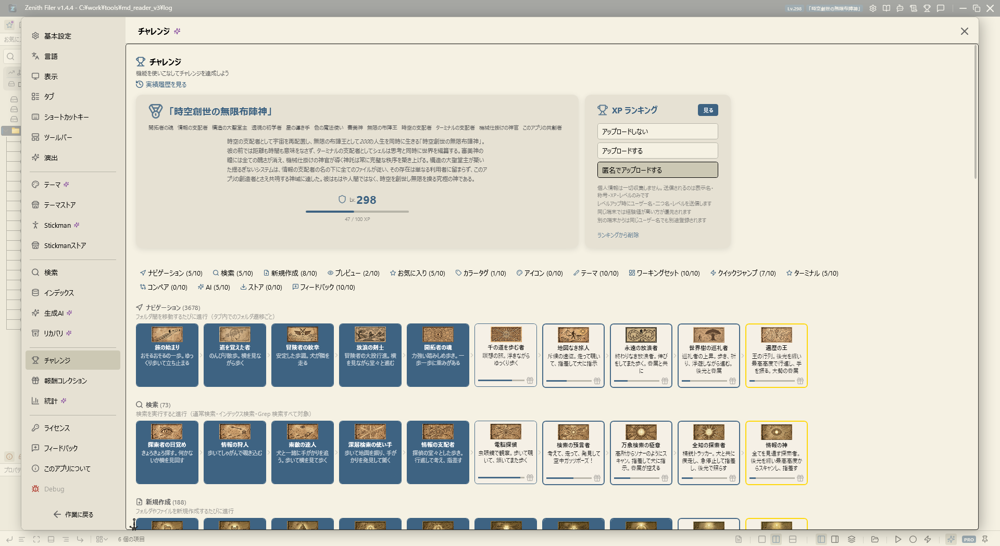
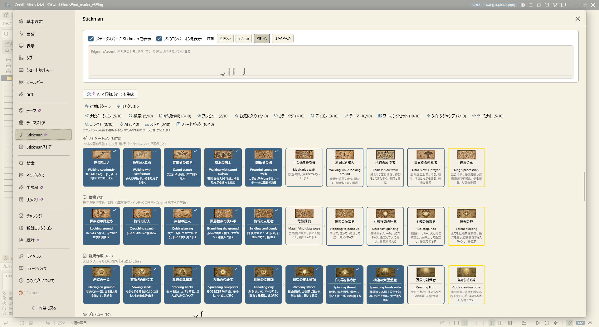
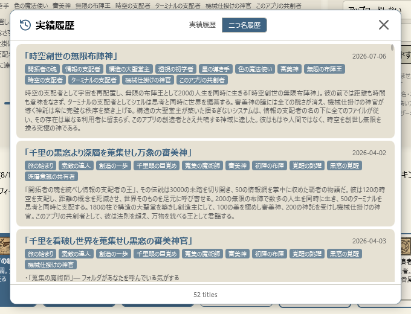

  

<h1 align="center">Zenith Filer</h1>

  <b>A fast, themeable dual-pane file manager for Windows — with an achievement system that grows as you use it.</b> 
  速くて、育てられる。Windows 用タブ型 2 ペインファイラー

  
  
  
  

  <a href="https://github.com/sulkyjp/zenithFiler_update/releases/latest"><b>⬇ Download (Free) / ダウンロード（無料）</b></a>
  ・
  <a href="https://www.vector.co.jp/soft/winnt/util/se528637.html">Get it on Vector / Vector で入手</a>

---

## Zenith Filer in 4 Lines / 4 行でわかる Zenith Filer

- ⚡ **Fast** — starts in about 1 second, every operation runs asynchronously. Optimized on real measurements to stay snappy even on antivirus-laden corporate PCs **速い** — 起動約 1 秒・全操作を非同期化。ウイルス対策ソフトで重い社用 PC でも軽快に動くよう実測ベースで最適化
- 🤖 **AI runs through the whole app** — 12 AI-powered features across 6 providers, including **Ollama for a fully local LLM** so nothing ever leaves your machine. Every feature still works with AI switched off **AI がアプリ全体に効く** — 12 系統の AI 機能を 6 プロバイダで。**Ollama なら完全ローカル LLM** で動き、データは PC の外に出ない。AI をオフにしても全機能そのまま使える
- 🖥 **A terminal and a scripting engine live inside it** — a ConPTY terminal in up to 4 panes at once, path-synced with the file panes, plus JavaScript macros with a visual node editor **ターミナルとマクロが中にある** — ConPTY ターミナルを最大 4 面同時、ファイルペインとパス連動。JavaScript マクロはノードエディタ付き
- 🎨 **Grows with you** — 50 built-in themes + community store + AI theme generation, plus 150 achievements that unlock as you use it **育てられる** — 内蔵テーマ 50 種＋コミュニティストア＋AI テーマ生成、使い込むほど解除される実績 150 種

<table>
  <tr>
    <td></td>
    <td></td>
    <td></td>
  </tr>
  <tr>
    <td></td>
    <td></td>
    <td></td>
  </tr>
</table>

Same app, different theme — switch with one click from 50 built-in options 同じアプリ、別のテーマ — 内蔵 50 種からワンクリックで切替

<table>
  <tr>
    <td width="50%"></td>
    <td width="50%"></td>
  </tr>
</table>

Left: catalog of 50 built-in themes / Right: 150 achievements that unlock as you use the app, each with an AI-generated title 左: 内蔵テーマ 50 種のカタログ　／　右: 使い込むほど解除される実績 150 種と AI が授ける「二つ名」

---

## Download / ダウンロード

**[Download the latest release / 最新版をダウンロード](https://github.com/sulkyjp/zenithFiler_update/releases/latest)** — just unzip the ZIP, no installation required ZIP を展開するだけ、インストール不要

<!-- download-table:begin -->
| File ファイル | Description 説明 |
|---|---|
| `ZenithFiler_v1.14.9.zip` | **Full** — includes the .NET runtime. Best for first-time installs or moving to a new machine **完全版** — .NET ランタイム同梱。初回導入や環境移行に |
| `ZenithFiler_v1.14.9_delta_from_1.14.8.zip` | **Delta** — only the files that changed since the previous version **差分版** — 前バージョンから変更されたファイルのみ |
<!-- download-table:end -->

Supported OS: Windows 10 / 11 (x64) / 対応 OS | Stays current via automatic delta updates / 導入後は差分自動アップデートで常に最新

## Free & Pro / 無料版と Pro

Every feature can be **tried for free** (a handful of features have a usage-count limit). Purchasing a Pro license removes all limits. すべての機能を**無料で試用できます**（一部機能に回数制限あり）。Pro ライセンスの購入で全機能が無制限になります。

**[Buy a Pro license on Vector](https://www.vector.co.jp/soft/winnt/util/se528637.html)** (also available for download there) **[Vector で Pro ライセンスを購入](https://www.vector.co.jp/soft/winnt/util/se528637.html)**（ダウンロードも可能）

---

## Key Features / 主な機能

Click any item to expand details / 各項目をクリックで詳細表示

<b>🎨 Themes — 50 built-in, store, AI generation テーマ — 内蔵 50 種・ストア・AI 生成</b>

| Feature 機能 | Description 説明 |
|---|---|
| 50 built-in themes 50 テーマ内蔵 | 5 categories × 10 (Standard / Lifestyle / Professional / Premium / RetroTech) 5 カテゴリ × 10（Standard / Lifestyle / Professional / Premium / RetroTech） |
| Theme store テーマストア | Download and rate community themes, submit your own コミュニティ製テーマのダウンロード・評価・自作テーマの投稿 |
| AI theme generation AI テーマ生成 | Generates a theme from a prompt like "dusk cyberpunk vibes" 「夕暮れのサイバーパンク風」のような指示文からテーマを自動生成 |
| Per-pane themes ペイン別テーマ | Apply different themes to the A pane, B pane, and nav pane A / B / ナビペインに異なるテーマを適用可能 |
| Customization カスタマイズ | Edit any of 62 color keys individually, saved non-destructively 62 色キーを色単位で編集、非破壊保存 |
| Random / Schedule ランダム / スケジュール | Random theme on every launch, or automatic day/night switching 起動ごとのランダム切替、昼夜での自動切替 |
| Theme diagnosis テーマ診断 | A 6-question quiz suggests a theme for you 6 問のアンケートでおすすめテーマを提案 |

<b>🏆 Achievements & the Stickman mascot 実績システム & Stickman マスコット</b>

| Feature 機能 | Description 説明 |
|---|---|
| 150 achievements 実績 150 種 | 15 categories × 10 tiers, unlocked naturally through everyday file operations 15 カテゴリ × 10 段階。日々のファイル操作で自然に解除 |
| XP, levels, and titles XP・レベル・二つ名 | Level up as operations accumulate; the AI generates a "title" and backstory for you 操作の蓄積でレベルアップ。AI が「二つ名」と物語を生成 |
| Stickman Stickman | A mascot living in the status bar. Its repertoire of actions grows as you unlock achievements ステータスバーに住むマスコット。実績解除で行動レパートリーが増加 |
| Stickman store Stickman ストア | Download and submit community-made action patterns コミュニティ製の行動パターンをダウンロード・投稿 |
| Cross-device achievement sync 実績のデバイス間共有 | Merge achievements across multiple PCs via a shared folder 共有フォルダ経由で複数 PC の実績を統合 |

<b>🤖 AI integration (optional — every feature works with it off) AI 連携（任意・オフでも全機能利用可）</b>

| Feature 機能 | Description 説明 |
|---|---|
| Supported providers 対応プロバイダ | Claude / OpenAI / Azure OpenAI / Gemini / Ollama (local LLM) Claude / OpenAI / Azure OpenAI / Gemini / Ollama（ローカル LLM） |
| File operations ファイル操作系 | AI-assisted renaming, folder organization suggestions, automatic folder creation, favorites cleanup AI リネーム、フォルダ整理提案、フォルダ自動作成、お気に入り整理 |
| Analysis 分析系 | AI analysis of usage statistics, tab-management suggestions, backup content summaries 利用統計の AI 分析、タブ管理提案、バックアップ内容の要約 |
| Generation 生成系 | Theme generation, Stickman action generation, achievement title generation テーマ生成、Stickman 行動生成、実績二つ名の生成 |
| AI manual AI マニュアル | No need to read the full manual — just ask "how do I...?" and the AI answers based on it 分厚いマニュアルを読まなくても、「〇〇するには？」と質問すれば AI がマニュアルを踏まえて回答 |

<b>🖥 Built-in terminal — up to 4 panes, ConPTY 内蔵ターミナル — 最大 4 面・ConPTY</b>

| | |
|---|---|
| Real shell 本物のシェル | Runs cmd.exe or PowerShell through ConPTY — not a fake console. ANSI 256-color and CJK character widths are handled correctly ConPTY 経由で cmd.exe / PowerShell を動かす。ANSI 256 色・CJK 文字幅に対応 |
| Up to 4 at once 最大 4 面同時 | Four terminals can be docked in the nav panes at the same time, each with its own working directory ナビペインに 4 面まで同時配置でき、それぞれ別のディレクトリを持てる |
| Path sync パス連動 | `cd` in the terminal moves the A or B pane with it; click a path in the terminal output to open it in a pane ターミナルで `cd` すると A / B ペインが追従。出力中のパスをクリックしてペインで開ける |
| Shell integration シェル統合 | Persistent command history with Ctrl+R search, per-command navigation (Ctrl+↑/↓), input prediction, and error lines marked in red コマンド履歴の永続化と Ctrl+R 検索、コマンド単位移動（Ctrl+↑/↓）、入力予測、エラー行の赤表示 |
| Claude Code integration Claude Code 連携 | Usage gauge, workspace picker, prompt history, and pasted images converted to file paths automatically 使用率ゲージ、ワークスペース選択、プロンプト履歴、貼り付けた画像を自動でパスに変換 |

<b>⚙️ Macros (JavaScript automation) マクロ（JavaScript 自動化）</b>

| Feature 機能 | Description 説明 |
|---|---|
| JavaScript engine JavaScript エンジン | Automate file operations and navigation with scripts ファイル操作・ナビゲーションをスクリプトで自動化 |
| Nav pane integration ナビペイン統合 | Run macros instantly from a list view in the nav pane マクロ一覧ビューから即実行 |

<b>📁 File management (core) ファイル管理（コア）</b>

| Feature 機能 | Description 説明 |
|---|---|
| Dual panes デュアルペイン | Two independent file browsers — the A pane (center) and B pane (right) A（中央）/ B（右）の独立した 2 画面ファイルブラウザ |
| Tabbed browsing タブブラウジング | Multiple tabs per pane, each showing a different folder ペインごとに複数タブで別々のフォルダを表示 |
| View modes 表示モード | Details list / large icons / medium icons / small icons 詳細リスト / 大アイコン / 中アイコン / 小アイコン |
| Column sorting カラムソート | Sort ascending/descending by name, modified date, size, or extension 名前・更新日・サイズ・拡張子で昇順/降順切替 |
| File operations ファイル操作 | Copy / move / delete / rename (F2), with undo コピー / 移動 / 削除 / リネーム（F2）、操作の取り消し |
| Drag & drop ドラッグ＆ドロップ | Move or copy files between panes; right-drag to choose the action ペイン間のファイル移動・コピー、右ドラッグで操作選択 |
| Shell thumbnails シェルサムネイル | Automatic thumbnail generation and caching for image files 画像ファイルのサムネイル自動生成・キャッシュ |

<b>🧭 Navigation & nav pane (19 views) ナビゲーション & ナビペイン（19 ビュー）</b>

| View / Feature ビュー / 機能 | Details 詳細 |
|---|---|
| Favorites お気に入り | Bookmarks, description tags, virtual folders, search, drag-and-drop registration, Top 5 display ブックマーク、説明タグ、仮想フォルダ、検索、D&D 登録、TOP5 表示 |
| Directory tree ディレクトリツリー | Tree view of every drive, lazy loading, real-time sync 全ドライブのツリー表示、遅延読込、リアルタイム同期 |
| Recent files 最近使ったファイル | History of the last 100 accessed files, with count and timestamp 直近 100 件のアクセス履歴、回数・日時表示 |
| Browse history 参照履歴 | Grouped by date, with keyword search 日付グループ表示、キーワード検索 |
| Indexed search settings インデックス検索設定 | Manage target folders, incremental/full rebuild, progress display 対象フォルダ管理、差分/完全再構築、進捗表示 |
| Terminal ターミナル | Embedded terminal, multiple tabs, synced with A/B pane paths, ANSI 256-color support 埋め込みターミナル、複数タブ、A/B ペインパス連動、ANSI 256 色対応 |
| Breadcrumb bar ブレッドクラムバー | Hierarchical path navigation with a folder dropdown, switchable to text input 階層パスナビ＋フォルダドロップダウン、テキスト入力切替 |

<b>🔍 Search — full-text, grep, presets 検索 — 全文検索・grep・プリセット</b>

| Feature 機能 | Description 説明 |
|---|---|
| Indexed search インデックス検索 | Full-text search powered by Lucene.NET with Japanese morphological analysis Lucene.NET + 日本語形態素解析による全文検索 |
| Content search ファイル内容検索 | Fast grep powered by the ripgrep engine ripgrep エンジンによる高速 grep |
| Search presets 検索プリセット | 8 built-in presets plus user-created ones (updated today, huge files, images, etc.) ビルトイン 8 種＋ユーザー作成（今日更新・巨大ファイル・画像 等） |
| Filters フィルタ | By size / date / file type サイズ / 日付 / ファイル種別 |
| Index updates インデックス更新 | Automatic (real-time watch) / scheduled / manual, idle-only execution, eco mode 自動（リアルタイム監視）/ 定期 / 手動、アイドル時のみ実行、エコモード |

<b>👁 Quick preview クイックプレビュー</b>

| Supported formats 対応形式 | Description 説明 |
|---|---|
| Text / code テキスト / コード | Real-time preview for .txt, .json, .bat, .ps1, and more .txt, .json, .bat, .ps1 等のリアルタイムプレビュー |
| PDF / HTML / images PDF / HTML / 画像 | Paginated PDF, web pages, jpeg/png/gif/webp, and more ページ送り付き PDF、Web、jpeg/png/gif/webp 等 |
| Office Office | Excel / CSV (with sheet selection), Word, PowerPoint Excel / CSV（シート選択）、Word、PowerPoint |
| Text diff テキスト差分 | Side-by-side diff view for two files 2 ファイルの Diff 表示 |

<b>🎛 Customization — settings, keybindings, languages カスタマイズ — 設定・キーバインド・多言語</b>

| Feature 機能 | Description 説明 |
|---|---|
| Keybindings キーバインド | Freely remap 25+ actions, with JSON export/import 25 以上のアクションを自由に変更、JSON エクスポート/インポート |
| 12 effect categories エフェクト 12 カテゴリ | Toggle animations on/off by area アニメーションを部位別に ON/OFF |
| Display settings 表示設定 | 4 row-height levels, show extensions/hidden files 行高 4 段階、拡張子・隠しファイル表示 |
| 10 languages 10 言語対応 | Japanese, English, Chinese (Simplified/Traditional), Korean, German, Spanish, French, Russian, Portuguese — switch without restarting 日英中（簡/繁）韓独西仏露葡、再起動なしで切替 |
| Working sets ワーキングセット | Save an entire tab layout and display state, restore with one click タブ構成・表示状態を丸ごと保存し、ワンクリック復元 |
| Nav pane layout presets ナビペイン構成プリセット | Save named sidebar view layouts, auto-applied on launch サイドバーのビュー構成を名前付きで保存し、起動時に自動適用 |
| Settings backup 設定バックアップ | Snapshots with descriptions, restore with one click 説明付きスナップショット、ワンクリック復元 |

<b>🖥 System integration — tray, snapping, Box Drive システム統合 — 常駐・スナップ・Box 連携</b>

| Feature 機能 | Description 説明 |
|---|---|
| Automatic updates 自動アップデート | Three-tier updates — delta / patch / full. No need to redownload everything デルタ / パッチ / フルの 3 段階更新。再ダウンロード不要 |
| Background mode 常駐モード | Runs from the system tray, summoned instantly with a global hotkey タスクトレイ常駐、グローバルホットキーで即呼び出し |
| Window snapping ウィンドウスナップ | One-touch placement into 8 layouts — 4 halves and 4 quarters 画面半分 ×4・4 分割 ×4 の 8 方向へワンタッチ配置 |
| Remembers window position ウィンドウ位置の記憶 | Restores position and size on next launch 終了時の位置・サイズを次回起動時に復元 |
| Window layout presets ウィンドウ配置プリセット | Save frequently-used positions/sizes by name; apply with one click or automatically on launch よく使う位置・サイズを名前付きで保存し、ワンクリック適用・起動時自動適用 |
| Multi-monitor protection マルチディスプレイ保護 | Automatically rescues the window if an external display disconnect leaves it off-screen 外部ディスプレイ切断でウィンドウが画面外に取り残された場合は自動レスキュー |
| Explorer integration Explorer 連携 | Integrates with the shell context menu (can toggle back to its own menu) シェルコンテキストメニュー統合（独自メニューと切替可） |
| Box Drive integration Box Drive 連携 | Detects BOX:// paths, retrieves share links, API integration BOX:// パス検出、共有リンク取得、API 連携 |
| Statistics 統計 | Tracks 21 kinds of operation counts, folder-visit rankings 21 項目の操作カウント、閲覧フォルダランキング |
| Built-in documentation 統合ドキュメント | Browse the manual and changelog inside the app (auto-switches between Japanese and English) マニュアル・変更履歴をアプリ内で閲覧（日英自動切替） |
| Send feedback フィードバック送信 | Send comments, requests, or bug reports straight to the developer from inside the app (no account needed) 意見・要望・不具合報告をアプリ内から作者へ直接送信（アカウント登録不要） |
| Error-report assistance エラー報告支援 | When something goes wrong, an auto-formatted report form opens and can be sent as-is 不具合発生時はエラー内容が自動で整形された報告フォームが開き、そのまま送信可能 |

<b>📸 Screenshots スクリーンショット集</b>

 
Stickman — a mascot whose repertoire of actions grows as you unlock achievements 
Stickman — 実績解除で行動レパートリーが増えていくマスコット 

  
The AI-generated "title" and backstory assembled from your achievements 
AI が実績の組み合わせから生成する「二つ名」とその物語 

  
Two-pane mode 
2 画面モード 

  
Single-pane mode 
1 画面モード 

  
Sending feedback from inside the app 
アプリ内からフィードバックを送信 

  
Manual page (switches between Japanese and English with the language setting) 
マニュアルページ（言語設定に連動して日英切替） 

  
Custom context menu and Explorer-compatible menu 
独自コンテキストメニューとエクスプローラ互換メニュー 

  
Automatic updates 
自動アップデート 

<b>📋 Latest Changes 最新の変更履歴</b>

<!-- latest-changes:begin -->
## Latest Changes — [1.14.9] - 2026-09-04 : Macros can be stopped and repeated, passed around, and now speak ten languages

### Added

- **A running macro can now be stopped (#282):** Once a macro started, there was **nothing to do but wait for it to finish** — even a mistyped one working its way through hundreds of files could only be waited out until the two-minute limit. Macro Studio's toolbar now shows a **"⏹ Stop" button while a macro is running**. Pressing it interrupts the run on the spot, and **everything it did up to that point comes back with a single `Ctrl+Z`**. Stop applies to more than the ▶ button in the studio: it also reaches macros started from **the nav pane list, the status bar, a keyboard shortcut, or the command palette** (every entry point now goes through one place). Alongside that, **a macro will not start while another one is running** — which keeps the same macro from being launched twice and fighting itself over the same files.

- **Macro runs are now recorded in a history (#282):** The result panel only ever showed **the most recent run**, and the next run wiped it. That hurt most with **automatic runs**: a macro started by a folder watch, a schedule or at startup left **no way to tell afterwards whether it had run at all** (successful runs are not written to the log either). Macro Studio now has a "Run history" section at the bottom right. Opening it lists the last 30 runs, newest first, with **the time, the macro's name, whether it succeeded, and how long it took**. Each row is marked with where it came from (**▶ manual / ⏻ startup / ⏰ schedule / 👁 folder watch**), and hovering shows a summary of the result — the reason, when it failed. **A macro that ran overnight can be checked here the next morning.** The history keeps 200 entries, dropping the oldest, and "Clear history" empties it at any time. It lives in the same `data` folder as everything else and is **not touched until you open it**, so startup is unaffected.

- **Line numbers and syntax colours in macro code (#286):** The Code tab and the "🧩 Script" part's editor were **plain text boxes with neither line numbers nor colours**. Being told an error was on "line 12" meant counting by eye, and longer macros were hard to read. Both are now the editor used for file previews, with **line numbers** and **JavaScript colouring** (keywords, strings, numbers, comments). **The colours come from the theme**, so nothing sinks into the background in any of the 50 bundled themes.

- **New "repeat" part for macros (#280):** A macro's only control structure was **the conditional branch**, which left "do this to every file that matches" — **the most basic shape a file manager's macro takes** — expressible only by hand-writing JavaScript into a 🧩 Script part (looping the wires on the canvas does not produce a loop). The palette now has **"🔁 Repeat"**. Choose what to walk over — **the folder's contents** or **the selected items** — and optionally narrow it with a filter such as `*.pdf`. Two wires leave the part: **what you connect to "repeat" is the body**, and **what you connect to "afterwards" runs once the loop is done** — the same shape as the conditional branch, so there is nothing new to learn. Inside the loop, the current item is available through the **`{item}` (name), `{itemExt}` (extension), `{itemPath}` (full path) and `{itemDate:yyyy-MM}` (modified date)** tokens. **"File all the PDFs into monthly folders" can now be built without writing a single line of script.** The AI generator uses the part too, so requests of the "every file that…" kind come back as parts you can read instead of a block of script.

- **Macros can now call the app's own features (#278):** The macro vocabulary was about two dozen calls, which left **compression, extraction, Grep, folder compare, folder sync, batch rename, hashing and favourites** out of reach. Those features are, however, already registered as **roughly 100 actions** — the ones keyboard shortcuts and the command palette use. **`zen.action("FileList.BatchRename")`** bridges to them. **That single call opens nearly the whole app to macros.** Misspell an action and the error names the closest matches (`FileList.Renmae` → `FileList.Rename`); call one that cannot run right now and the error says so. Note that **an action is only started, not waited for** — put a "⏱ Wait" after it if the macro goes on to touch the result. For safety, each `zen.action` call counts as one destructive operation, so the runaway cap still applies.

- **Macros can ask for a value while they run (#281):** All a running macro could ask was **yes or no** — there was no way to have someone type something in. That ruled out "type a prefix, then batch-rename" or "pick the destination on the spot": **reusing one macro with different values** was impossible, so the only option was a pile of near-identical macros with the values baked in. Writing **`{prompt:Enter a prefix}`** in an argument now brings up an input box at run time and drops what you type into that spot; **`{promptFolder}`** opens the folder picker instead. Both are in the "{ }" button's list. **Cancelling the input stops the macro then and there** — better than moving files under a half-finished name. Hand-written macros can call `zen.prompt("message", "default")` directly, which returns `null` on cancel so you can branch on it yourself.

- **Macros can now be passed around (#283):** Themes and the stickman both have a way to share, but **macros had none** — the storage format was one file per macro from the start; only the UI was missing. In Macro Studio's library column, **"Export…"** in the right-click menu saves a macro as a single `.json`, and **"Import…"** in the column header brings one in. **Before it is imported, you are shown what the macro does** — "Deletes files", "Moves files", "Sends a request to the AI", "Runs JavaScript directly" — so what would otherwise only become clear on the first run is readable before you decide. A macro can run arbitrary JavaScript and delete files, so this is built on the premise that **importing someone else's macro is not as safe as importing a theme**. An imported macro **does not run**: it opens in the studio so you can look it over. **Its triggers — startup, schedule, folder watch, shortcut — are not carried over**, so a macro someone sent you never starts running the moment it arrives.

- **Recording now captures far more, and opens as nodes (#284):** "Do it once, have it remembered, replay it" is **the lowest doorstep into macros** — the first thing someone touches who knows neither JavaScript nor node graphs. Yet all it recorded was **navigating folders and searching**, which left anyone who tried it concluding that recording was useless. It now also records **selecting items, copying, moving, renaming, deleting to the Recycle Bin, creating folders, and opening or closing tabs.** What comes out now opens **as nodes (parts)** — until now it always opened as code, so "record it, then adjust it in the node view" never joined up. Each line becomes one part, and **anything the parts cannot express stays as a "🧩 Script" part**, so nothing you did is lost. Two new parts came with it — "🖱 Select" and "✖ Close tab" — along with `zen.select` and `zen.closeTab`. Only **the final state of a selection** is kept, so re-picking files does not fill the recording with noise, and **copies or moves that leave the current folder are not recorded** (they could not be replayed as they are).

### Changed

- **Deletions made by a macro now say they cannot be undone with `Ctrl+Z` (#277):** Everything a single macro run does is undone **together, with one `Ctrl+Z`** — except deletions. Sending a file to the Recycle Bin is **outside `Ctrl+Z` elsewhere in the app too** (pressing `Delete`, for one). So a macro that creates a folder, moves files into it and deletes the leftovers would **undo the creation and the moves but silently leave the deletion standing**, with nothing to say so. A macro that deleted anything now ends its output with **"the N item(s) deleted cannot be restored with Ctrl+Z (restore them from the Recycle Bin)"**. What was deleted is still in the Recycle Bin, as before, and can be restored from there.

- **A failing macro now says which line failed (#282):** The error read `❌ Error: ...` and nothing more — **it never said where the macro fell over**, even though the JavaScript engine knows the position and was simply throwing it away. Errors now carry the line: `❌ Error: line 3: ...`. Typos (syntax errors) report their line the same way. Together with the line numbers from #286, the line you are told about is the line you can go to.

- **Macro Studio now speaks all ten languages (#285):** Measured across the app, **Macro Studio was the one screen still in Japanese only**. Everything else was available in ten languages, while here the part names and their descriptions were Japanese — which left macros **effectively unusable outside Japan**. The names and descriptions of all 21 parts, the argument labels, the condition names, what a loop runs over, the outlet names (yes / no / repeat / afterwards), the `{ }` token list, the "common values" presets, and the buttons and tooltips on screen — **138 strings in total — are now translated into ten languages** (Japanese, English, German, Spanish, French, Korean, Portuguese, Russian, Simplified and Traditional Chinese). For presets, **the value that gets filled in follows the language too**, so someone working in English is never made to create a folder named 完了. A test now fails if Japanese is written directly into this screen again, so it cannot quietly drift back.

### Fixed

- **Fixed macros being able to reach files outside the folder you have open (#276):** A macro's file operations — move, copy, rename, delete — are confined to **the folder currently open**. That check compared **the beginning of the path as plain text**, so with `C:\work` open, **anything inside `C:\work2` or `C:\work_backup` counted as "inside the folder"**: a neighbouring folder whose name merely starts the same way was within reach of a move or a delete. The check now includes the separator, and **escaping through a shortcut (symbolic link or junction) is closed off as well**. The **folder you have open** can also no longer be named as the target of a delete, move or rename. Now that a macro can be assembled by describing it to an AI, a mistaken path is **not something you would catch by eye** — this closes that off. "Organise folder with AI", which shares the same check, is fixed along with it.

- **Fixed a partly-failed undo looking like it had succeeded (#277):** When undoing an operation that touched many files at once, **a step that cannot be reversed no longer stops the rest** — that part was already right. But the failure **only ever went to the log**, and what appeared on screen was the same "Undone" as a complete success: 3 of 10 files could be sitting where they were with nothing to hint at it. The notification now reports **how many could not be undone, and which ones**. It matters most for operations that touch many files at once, such as macros and batch rename.

> See [Releases](https://github.com/sulkyjp/zenithFiler_update/releases) for the full history.

---

## 最新の変更履歴 — [1.14.9] - 2026-09-04 : マクロを止められるようにし、くり返し・受け渡し・10言語対応までまとめて仕上げた

### Added

- **実行中のマクロを止められるようにした (#282):** これまでマクロは、走り出したら**終わるまで待つしかありません**でした。書き間違えて何百件ものファイルを触り始めても、2 分の制限時間が来るまで止める手立てがありません。マクロスタジオのツールバーに、**実行中だけ「⏹ 停止」ボタン**が出るようにしています。押すとその場で中断し、**そこまでに行った操作は 1 回の `Ctrl+Z` でまとめて戻せます**。停止は、スタジオの ▶ から実行したものだけでなく、**ナビペインの一覧・ステータスバー・ショートカット・コマンドパレットから実行したマクロにも効きます**（実行の入口をすべて 1 か所にまとめたためです）。あわせて、**マクロの実行中は次の実行を受け付けない**ようにしました。同じマクロが二重に走って同じファイルを取り合う事故を防ぐためです。

- **マクロの実行履歴を残すようにした (#282):** これまで実行結果は**最新の 1 回分だけ**が表示され、次を実行すると消えていました。とくに困るのが**自動実行**です。フォルダ監視・時刻指定・起動時に走らせたマクロは、**動いたのかどうかを後から確かめる手段がありませんでした**（成功した実行はログにも残りません）。マクロスタジオの右下に「実行履歴」を追加しています。開くと直近 30 件が、**実行時刻・マクロ名・成否・所要時間**とともに新しい順に並びます。行の頭にはどこから走ったかの印が付き（**▶ 手動 / ⏻ 起動時 / ⏰ 時刻指定 / 👁 フォルダ監視**）、マウスを載せると結果の要約（失敗ならその理由）が出ます。**夜間に自動で走らせたマクロの結果を、翌朝ここで確かめられます。** 履歴は 200 件を超えると古いものから消え、「履歴を消す」でいつでも空にできます。履歴の置き場所は他のデータと同じ `data` フォルダの中で、**開くまで読み書きしない**ので起動は今までどおりです。

- **マクロのコードに行番号と色分けが付いた (#286):** コードタブと「🧩 スクリプト」部品の入力欄は、**行番号も色分けもない素の入力欄**でした。エラーで「12 行目」と言われても目で数えるしかなく、長いマクロほど読みづらい状態です。ファイルのプレビューで使っているエディタに置き換え、**行番号の表示**と **JavaScript の色分け**（予約語・文字列・数値・コメント）を入れています。**色はテーマから引く**ので、50 種類のどのテーマでも沈みません。

- **マクロに「くり返し」部品を入れた (#280):** これまでマクロの制御構造は**条件分岐だけ**で、「条件に合うファイル全部に対して〜する」という、**ファイラーのマクロで最も基本的な形**が、🧩 スクリプト部品に JavaScript を手書きする以外に表せませんでした（キャンバス上で線を輪にしても繰り返しにはなりません）。パレットに **「🔁 くり返し」** を追加しています。回す対象は**フォルダの中身**か**選択中のアイテム**から選び、`*.pdf` のようなフィルタを添えられます。部品からは線が 2 本出て、**「くり返す」につないだ部品が中身**、**「そのあと」につないだ部品がループを抜けた後**です（条件分岐と同じ形なので、覚えることは増えません）。くり返しの中では、いま取り出しているアイテムを **`{item}`（名前）／`{itemExt}`（拡張子）／`{itemPath}`（フルパス）／`{itemDate:yyyy-MM}`（更新日時）** のトークンで指せます。**「PDF を全部 月別フォルダへ移す」が、スクリプトを 1 行も書かずに組めます。** AI 生成もこの部品を使うようになったので、これまでスクリプト部品に落ちていた「全ファイルに対して〜」が、読める部品の形で出てきます。

- **マクロからアプリの機能を直接呼べるようにした (#278):** マクロ専用の命令は 20 数個しかなく、**圧縮・解凍・Grep 検索・フォルダ比較・フォルダ同期・一括リネーム・ハッシュ・お気に入り**といった主要機能には手が届きませんでした。一方でそれらは、キー割り当てとコマンドパレットが使う**約 100 個のアクション**として既に登録されています。そこへ橋を架ける **`zen.action("FileList.BatchRename")`** を追加しました。**この 1 つで、アプリのほぼ全機能がマクロから呼べます。** アクション名を打ち間違えたときは「近いもの」を添えて知らせます（例: `FileList.Renmae` → `FileList.Rename`）。いま実行できないアクションを呼んだ場合も、その旨のエラーになります。なお **アクションは実行を開始するだけで、終わるのは待ちません** — 続けて結果を触るマクロでは「⏱ 待機」を挟んでください。安全のため、`zen.action` の呼び出しは 1 回を破壊的操作 1 件として数えます（暴走時の上限がそのまま効きます）。

- **マクロが実行時に値を尋ねられるようにした (#281):** これまでマクロが実行中にユーザーへ聞けるのは**はい／いいえだけ**で、文字を入力してもらう手段がありませんでした。そのため「毎回プレフィックスを入力して一括リネーム」「移動先をその場で選ぶ」といった、**1 つのマクロを値だけ変えて使い回す**形が作れず、値を焼き込んだ別マクロを量産するしかありませんでした。引数欄に **`{prompt:接頭辞を入力}`** と書くと、実行時に入力欄が出て、入れた文字がそこへ入ります。**`{promptFolder}`** ならフォルダ選択のダイアログが出ます。どちらも「{ }」ボタンの一覧から選べます。**入力をキャンセルするとマクロはその場で止まります**（中途半端な名前でファイルが動くのを防ぐためです）。手書きのマクロからは `zen.prompt("メッセージ", "既定値")` を使うと、キャンセル時に `null` を受け取って自分で分岐することもできます。

- **マクロを受け渡せるようにした (#283):** テーマとスティックマンには共有の仕組みがあるのに、**マクロにだけ渡す手段がありませんでした**（保存の形式は最初からファイル 1 つで、UI が無いだけの状態です）。マクロスタジオのライブラリ列で、右クリックの **「書き出す…」** で 1 つの `.json` として保存でき、見出しの **「読み込む…」** で取り込めます。**取り込む前に、そのマクロが何をするのかが一覧で出ます** — 「ファイルを削除します」「ファイルを移動します」「AI に問い合わせます」「JavaScript を直接実行します」のように、実行して初めて分かるのでは遅いことを、決める前に読めます。マクロは任意の JavaScript を実行してファイルを消せるので、**他人のマクロの取り込みはテーマの取り込みとは危険度が違う**という前提で作っています。取り込んだマクロは**その場では実行されず**、中身を確かめられるようスタジオで開きます。**自動実行の設定（起動時・時刻指定・フォルダ監視・ショートカット）は持ち込まれません** — もらったマクロが、取り込んだ瞬間に走らないようにするためです。

- **記録できる操作を大きく広げ、記録した内容をノードで開くようにした (#284):** 「やったことを覚えさせて再生する」は、JavaScript もノードも知らない人が最初に触る、**マクロへの最も敷居の低い入口**です。ところが記録できるのは**フォルダ移動と検索の 2 つだけ**で、試した人が「使えない」と判断してしまう状態でした。**アイテムの選択・コピー・移動・リネーム・ゴミ箱へ削除・フォルダ作成・タブの開閉**も記録するようにしています。さらに、記録の結果は**ノード（部品）として開きます** — これまでは必ずコードで開いていたため、「記録して、ノードで手直しする」という自然な流れが繋がっていませんでした。1 行が 1 部品に対応し、**部品で表せない行はその部分だけ「🧩 スクリプト」部品として残る**ので、記録した内容が失われることはありません。あわせて「🖱 選択」「✖ タブを閉じる」の部品と、`zen.select` / `zen.closeTab` を追加しました。選択は**最後にどうなったかだけ**を残すので、選び直した経過で記録が埋まることはありません。**現在フォルダの外へ出るコピー・移動は記録しません**（そのままでは再生できないためです）。

### Changed

- **マクロで削除したものは `Ctrl+Z` で戻らないことを、実行結果に書くようにした (#277):** マクロ 1 回分の操作は、**まとめて 1 回の `Ctrl+Z`** で元に戻せます。ところが**削除だけは戻りません** — ゴミ箱へ送る操作は、`Delete` キーでの削除など**アプリの他の場所でも `Ctrl+Z` の対象外**だからです。そのため「フォルダを作って・ファイルを移して・いらないものを消す」と書いたマクロでは、**作成と移動は戻るのに削除だけ戻らない**という食い違いが、何も知らせないまま起きていました。削除を含むマクロを実行すると、結果の末尾に **「削除した N 件は Ctrl+Z では戻りません（ゴミ箱から復元してください）」**と出るようにしています。削除したものはこれまでどおりゴミ箱に残っているので、そこから復元できます。

- **マクロが失敗したときに「何行目か」が出るようになった (#282):** 従来のエラー表示は `❌ エラー: ...` というメッセージだけで、**どこで落ちたのかは書かれていませんでした**。マクロの実行環境は失敗した位置を持っているのに、それを捨てていたためです。`❌ エラー: 3 行目: ...` のように**行番号を添える**ようにしています。書き間違い（構文エラー）でも同じ形で行番号が出ます。#286 の行番号表示とあわせて、言われた行をそのまま探せます。

- **マクロスタジオを 10 言語に対応させた (#285):** 実測すると、**マクロスタジオはアプリで唯一、日本語のままだった画面**でした。他はすべて 10 言語で使えるのに、ここだけ部品の名前も説明も日本語のみで、海外の方には**マクロが事実上使えない**状態です。部品 21 種の名前と説明、引数の見出し、条件分岐の条件名、くり返しの対象、「はい／いいえ／くり返す／そのあと」の出口の名前、`{ }` トークンの一覧、「よく使う値」のプリセット、画面上のボタンとツールチップ — **合わせて 138 か所を 10 言語に翻訳しました**（日本語・英語・ドイツ語・スペイン語・フランス語・韓国語・ポルトガル語・ロシア語・簡体字・繁体字）。プリセットは見出しだけでなく**入る値も言語に合わせます** — 英語で使っている方が「完了」という名前のフォルダを作らされることはありません。あわせて、**この画面に日本語を直接書くと落ちるテスト**を入れたので、同じ状態には戻りません。

### Fixed

- **マクロが、開いているフォルダの外のファイルへ手を伸ばせてしまう場合があった問題を修正 (#276):** マクロのファイル操作（移動・コピー・リネーム・削除）は、**今開いているフォルダの中だけ**に限定しています。ところがこの判定が**パス文字列の先頭一致**で行われていたため、`C:\作業` を開いているときに **`C:\作業2` や `C:\作業_backup` の中身まで「フォルダの中」と見なされて**いました。名前がたまたま前方一致するだけの**隣のフォルダ**へ、移動や削除が届いてしまう状態です。区切り文字まで含めて判定するようにし、あわせて**ショートカット（シンボリックリンク・ジャンクション）を辿って外へ出る経路**も塞ぎました。**今開いているフォルダそのもの**を削除・移動・リネームの対象に指定することもできなくなります。指示を書いて AI にマクロを組ませられるようになった以上、**目視では気づけない指定ミス**が外へ及ばないようにするための修正です。同じ判定を使っている「AI でフォルダを整理」も同時に直っています。

- **「元に戻す」が一部しか戻せなかったときに、成功したように見えていた問題を修正 (#277):** たくさんのファイルをまとめて動かした操作を `Ctrl+Z` で戻すとき、**途中の 1 つが戻せなくても残りは戻し続ける**作りになっています。ところが**戻せなかったことは記録に残るだけ**で、画面に出るのは全部戻ったときと同じ「元に戻しました」でした。10 個のうち 3 個が元の場所に戻っていなくても、気づく手がかりがありません。**戻せなかった件数と、その対象の名前**を通知に出すようにしています。マクロや一括リネームのように、一度に多くのファイルを扱う操作ほど効きます。

> 過去の変更履歴は [Releases](https://github.com/sulkyjp/zenithFiler_update/releases) を参照してください。
<!-- latest-changes:end -->

---

  Developed by <a href="https://github.com/sulkyjp">sulkyjp</a> ・ <a href="https://github.com/sulkyjp/zenithFiler_feedback/issues">Feedback & bug reports / フィードバック・不具合報告</a>

