

  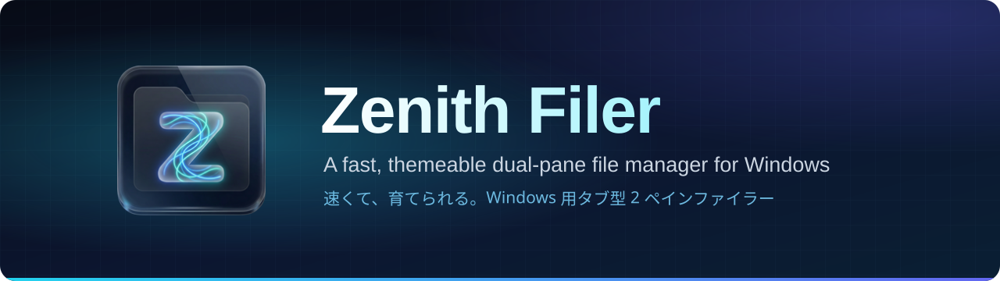

  
  
  
  
  

  
  &nbsp;
  

  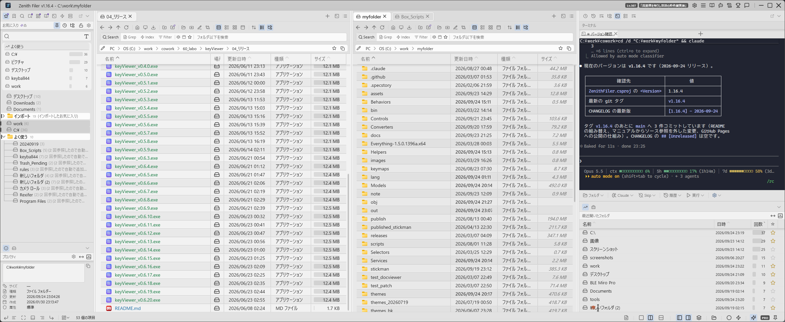

 

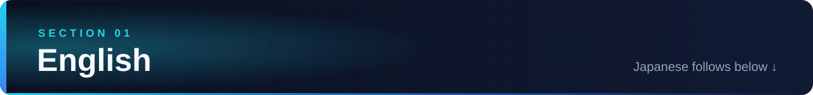

  <a href="#highlights"><b>Highlights</b></a> ·
  <a href="#download"><b>Download</b></a> ·
  <a href="#free--pro"><b>Free &amp; Pro</b></a> ·
  <a href="#features"><b>Features</b></a> ·
  <a href="https://sulkyjp.github.io/zenithFiler_update/"><b>Manual</b></a> ·
  <a href="#latest-changes"><b>Latest changes</b></a> ·
  <a href="#license"><b>License</b></a> ·
  <a href="#feedback"><b>Feedback</b></a>

## Highlights

<table>
  <tr>
    <td width="50%" valign="top">
      <h3>⚡ Fast</h3>
      Starts in about a second, and every operation runs asynchronously. Tuned on real measurements to stay responsive even on corporate PCs weighed down by antivirus software.
    </td>
    <td width="50%" valign="top">
      <h3>🧭 Never breaks your flow</h3>
      A ring launcher that opens around the cursor, a command palette that finds every action by name, and a shortcut for everything.
    </td>
  </tr>
  <tr>
    <td width="50%" valign="top">
      <h3>🖥 Terminal, macros &amp; AI inside</h3>
      Up to four ConPTY terminals that follow your folders, macros you build without code, and AI that can run fully locally with Ollama. Everything works with AI off.
    </td>
    <td width="50%" valign="top">
      <h3>🎨 Make it yours</h3>
      57 built-in themes, a community theme store, AI theme generation, and 150 achievements that unlock as you use it.
    </td>
  </tr>
</table>

<table>
  <tr>
    <td>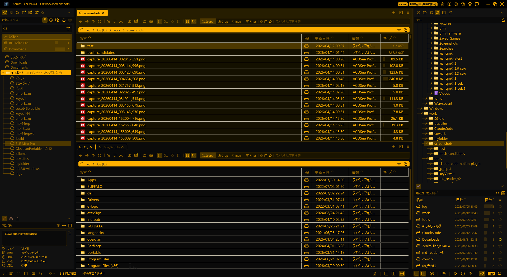</td>
    <td>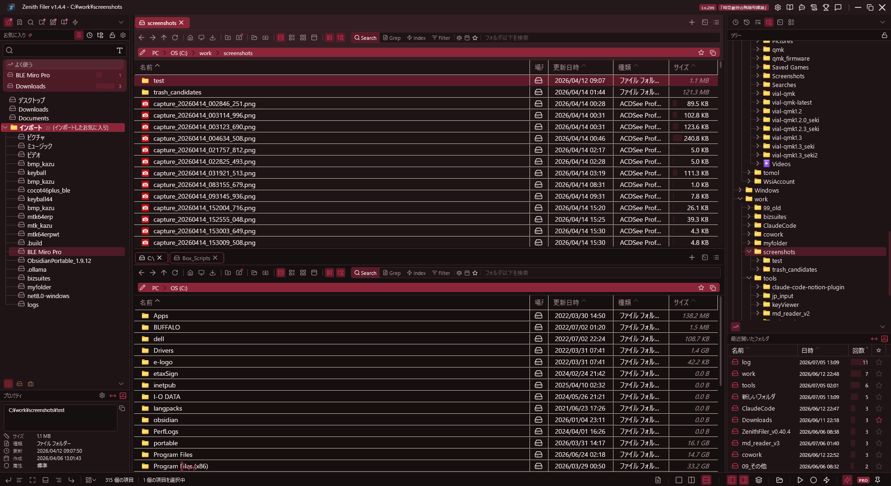</td>
    <td>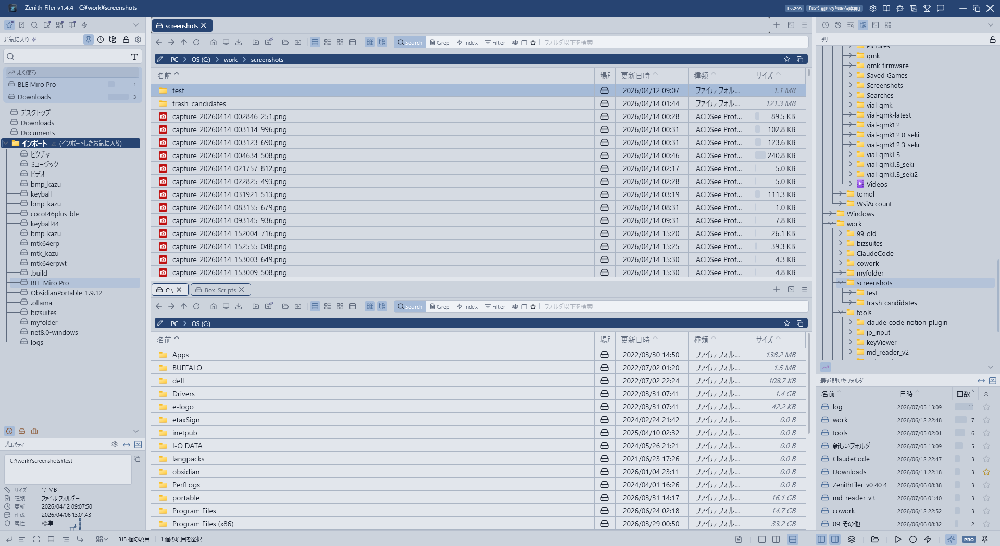</td>
  </tr>
  <tr>
    <td>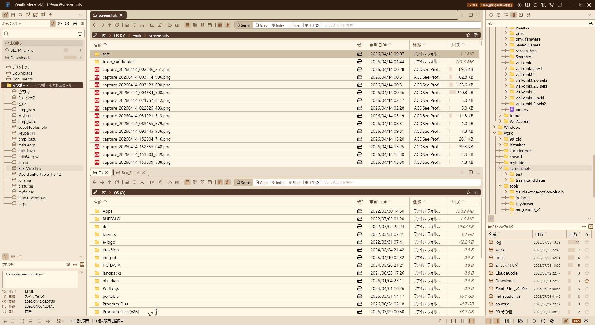</td>
    <td>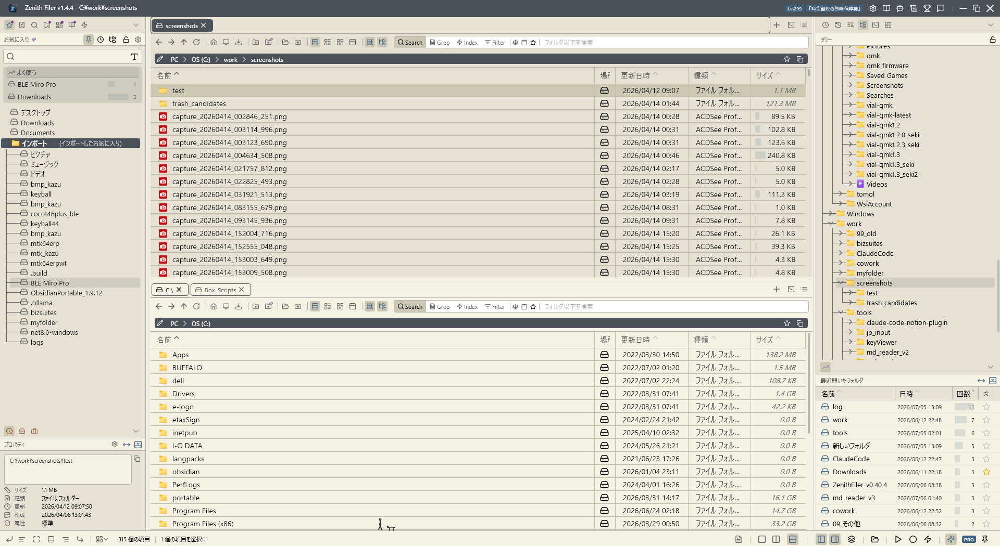</td>
    <td>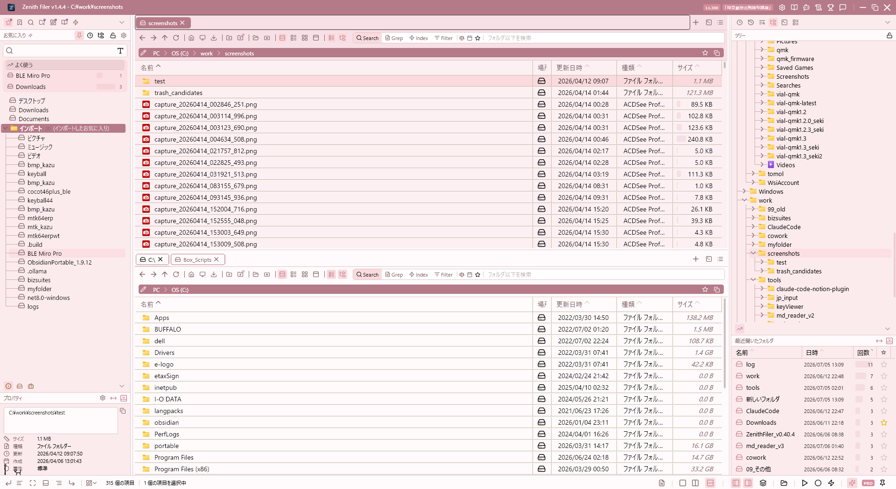</td>
  </tr>
</table>

Same app, different theme — switch with one click from 57 built-in themes

## Download

<!-- download-table-en:begin -->
| File | Description |
|---|---|
| `ZenithFiler_v1.17.2.zip` | **Full** — includes the .NET runtime. Best for first-time installs or moving to a new machine |
| `ZenithFiler_v1.17.2_delta_from_1.17.1.zip` | **Delta** — only the files that changed since the previous version |
<!-- download-table-en:end -->

> [!TIP]
> **No installer.** Unzip and run `ZenithFiler.exe`. Settings stay next to the app, so it runs from a USB stick too. Once installed, it keeps itself current with automatic delta updates.
> Supported OS: Windows 10 / 11 (x64).

## Free &amp; Pro

|  | Free | Pro |
|---|:---:|:---:|
| Browsing, file operations, terminal, themes, search | ✅ Unlimited | ✅ Unlimited |
| Exports, batch operations, folder sync, theme customization | Daily limit | ✅ Unlimited |
| Macros and AI features | Daily limit | ✅ Unlimited |

  

> [!NOTE]
> **$15, one-time, tax included.** Checkout is handled by [Polar](https://buy.polar.sh/polar_cl_u02Y6qn9QQJCPLre0LwBv58I8Ll2Cg7XYl7pj3PXcyt), which acts as the merchant of record. Your license key is emailed to you within 24 hours; enter it in Control Deck (`Ctrl+Shift+O`) → License.
> Buying from Japan? Use [Vector](https://www.vector.co.jp/soft/winnt/util/se528637.html) instead.

## Features

Click a category to expand it · Every feature is explained in the <a href="https://sulkyjp.github.io/zenithFiler_update/">online manual</a>

<b>🧭 Reach features without moving your hand</b>

| Feature | Description |
|---|---|
| Ring launcher | Press the left and right mouse buttons together and a ring of your 8 most-used actions opens around the cursor. Flick toward one and let go |
| Command palette | `Ctrl+Shift+P` finds and runs any action by name, description, or key — including actions with no shortcut bound |
| Keyboard shortcuts | Every action can be remapped, with JSON export and import. Shortcuts keep working during Japanese/IME input |
| Tabs and two panes | The A pane (center) and B pane (right), each with its own tabs. Single-pane mode is one click away |
| Working sets | Save an entire tab layout and restore it with one click |

<b>📁 File management</b>

| Feature | Description |
|---|---|
| File operations | Copy, move, delete, and rename with undo. Large copies and moves show a progress window with speed and time remaining, where each job can be paused or stopped |
| Drag and drop | Between panes and with other apps; right-drag to choose the action. Dropping onto a shortcut (.lnk) uses its target |
| Batch rename | Rename many files at once with a live preview |
| Batch timestamps & attributes | Change created/modified/accessed times and attributes of many items at once, previewing exactly what will change |
| Archives | Extract and compress ZIP and other formats from the right-click menu, including straight into the other pane |
| Folder compare & sync | Compare the folders in the A and B panes by size, time, or content hash, then sync A → B |
| Hash verification | Compute SHA-256 / SHA-1 / MD5 / CRC-32 and verify against a pasted value — the algorithm is detected automatically |
| FTP / SFTP / FTPS | Server folders open in a pane just like local ones |
| Phones and cameras | Browse MTP devices from the drive list |
| Thumbnails | Image and video thumbnails, freely resizable with `Ctrl+Wheel` |

<b>🖥 Built-in terminal — up to 4 panes, ConPTY</b>

| Feature | Description |
|---|---|
| A real shell | Runs cmd.exe or PowerShell through ConPTY, with correct ANSI 256-color and CJK character widths |
| Up to 4 at once | Four terminals can sit in the nav panes at the same time, each with its own working directory |
| Path sync | `cd` in the terminal moves the A or B pane with it; click a path in the output to open it in a pane |
| Shell integration | Persistent history with `Ctrl+R` search, jump between commands with `Ctrl+↑/↓`, input prediction, and error lines marked in red |
| Claude Code integration | Usage gauge, workspace picker, prompt history, and pasted images converted to file paths automatically |

<b>🤖 AI integration (optional — every feature works with it off)</b>

| Feature | Description |
|---|---|
| Providers | Claude / OpenAI / Azure OpenAI / Gemini / Ollama (local LLM) / Claude Code (CLI) |
| Fully local | With Ollama, nothing leaves your PC. Setup, model download, and server start/stop are handled by the app |
| File operations | AI-assisted renaming, folder organization suggestions, automatic folder creation, favorites cleanup |
| Analysis | Usage statistics analysis, tab-management suggestions, backup summaries |
| Generation | Themes, macros from a sentence, Stickman actions, and achievement titles |
| AI manual | Ask "how do I...?" and get an answer grounded in the manual |

<b>⚙️ Macros</b>

| Feature | Description |
|---|---|
| No-code building | Wire blocks together in Macro Studio, record your actual operations, or describe the macro in a sentence and let AI build it |
| JavaScript underneath | Full access to file operations and navigation through the `zen.*` API |
| Run your way | From the nav pane, the status bar, triggers, or repeatedly — and stop at any time |

<b>🧩 Nav panes — about 20 views</b>

| Feature | Description |
|---|---|
| Views | Favorites, directory tree (with Recycle Bin), recent files, browse history, search, sites (FTP/SFTP), macros, terminal, and more |
| Free layout | Put any view on either side, stack two views, or save the layout as a named preset |
| Detachable | Pop a view out into its own window and snap windows together |
| Automatic favorites | Folders you open often are suggested as favorites automatically |

<b>🔍 Search</b>

| Feature | Description |
|---|---|
| Indexed search | Full-text search powered by Lucene.NET, with Japanese morphological analysis |
| Content search | Fast grep powered by ripgrep |
| Presets and filters | 8 built-in presets plus your own; filter by size, date, and file type |
| Index updates | Real-time, scheduled, or manual; runs only when idle, with an eco mode |

<b>👁 Preview and compare</b>

| Feature | Description |
|---|---|
| Text and code | Live preview for .txt, .json, .bat, .ps1, and more |
| PDF / HTML / images | Paginated PDF, web pages, jpeg/png/gif/webp, and more |
| Office | Excel / CSV (with sheet selection), Word, PowerPoint |
| Text diff | Side-by-side comparison of two files |

<b>🎨 Themes</b>

| Feature | Description |
|---|---|
| 57 built-in themes | 5 categories: Standard / Lifestyle / Professional / Premium / RetroTech. The default, Plain, is white and light gray with no theme color |
| Theme store | Download and rate community themes, or submit your own |
| AI theme generation | Generate a theme from a prompt like "dusk cyberpunk vibes" |
| Per-pane themes | Give the A pane, B pane, and nav panes different themes |
| Customization | Edit any of 130 color keys; changes are saved separately and never overwrite the original |
| Random / schedule | A random theme on every launch, or automatic day/night switching |
| Fonts and icons | Set font and icon sizes per element |

<b>🏆 Achievements & the Stickman mascot</b>

| Feature | Description |
|---|---|
| 150 achievements | 15 categories × 10 tiers, unlocked naturally through everyday file operations |
| XP, levels, and titles | Level up as you work; AI writes you a title and a backstory |
| Stickman | A mascot living in the status bar that reacts to what you do. Its repertoire grows as you unlock achievements |
| Sync across PCs | Merge achievements from several PCs through a shared folder |

<b>🪟 System integration</b>

| Feature | Description |
|---|---|
| Automatic updates | Delta updates download only what changed |
| Background mode | Lives in the system tray and appears instantly with a global hotkey |
| Window snapping and presets | Snap to 8 layouts (halves and quarters), or save named positions and apply them on launch |
| Multi-monitor rescue | Brings the window back if a disconnected display leaves it off-screen |
| Explorer integration | The Windows context menu, including Windows 11-style entries — or the app's own menu |
| Box Drive | Detects Box paths and copies share links |
| 10 languages | English, Japanese, Chinese (Simplified/Traditional), Korean, German, Spanish, French, Russian, Portuguese — switch without restarting |
| Built-in manual | Per-feature manual and changelog inside the app |

<b>📸 Screenshots</b>

 
Stickman — a mascot whose repertoire grows as you unlock achievements 
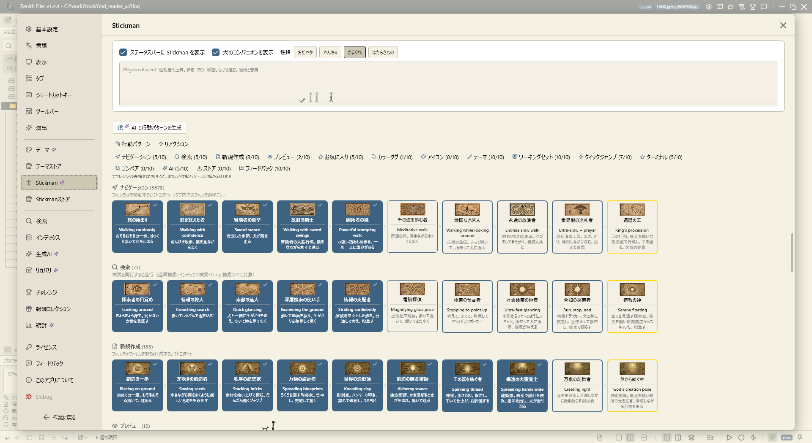
  
The AI-generated title and backstory built from your achievements 
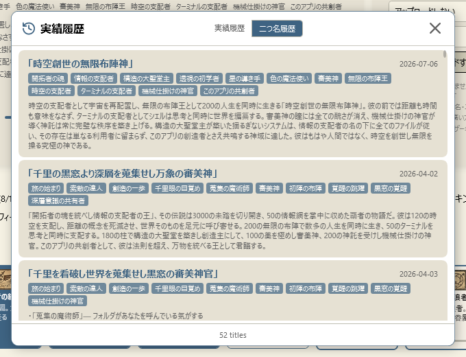
  
Two-pane mode 

  
Single-pane mode 

  
Sending feedback from inside the app 

  
The built-in manual (follows the language setting) 

  
The app's own context menu and the Explorer-compatible menu 

  
Automatic updates 

## Latest changes

<b>Show the notes for the latest release</b>

<!-- latest-changes-en:begin -->
**[1.17.2] - 2026-10-05 : Effects that make everyday actions feel smoother, tried out in preview builds, come to release builds; Shift+Delete and Alt+drag work as in File Explorer, AI can write descriptions for favorites, column width becomes one setting, file conflicts can be decided one by one, and a privacy policy is added**

### Added

- **Effects that make everyday actions feel smoother, and an option to turn off all effects on the Effects page (#364)** [Preview 1.17.0.2] — Row hover in the list, moving between folders and switching the pane you are working in all changed in an instant, which sometimes made it hard to see what had just changed. The hover fill on rows and the highlight on the drop target folder now fade in and out. After pasting, moving, creating or renaming, the affected rows glow briefly, and a folder that receives a drop glows too. When you move to another folder, the list fades in. If loading the destination takes 0.15 seconds or longer, a thin line runs along the top of the list, so you can tell it is loading while the old list is still showing. The colour of the pane you are working in also changes with a fade, and dialogs such as confirmations that used to appear without any effect now have one. None of these effects get in your way: the selection, the focus and the contents of the list are settled immediately regardless of any effect, and keys and clicks keep working while an effect is playing. On-screen elements themselves are never moved, so where you click never shifts. Every effect can be turned off under Control Deck > Effects. Turning on **Turn off all effects (instant display)** at the top stops them and switches the display instantly. A new category, **Feedback on actions**, covers moving between folders, switching panes, buttons and dialogs; button hover and the glow on pane dividers, which used to play regardless of the settings, can now be turned off with it as well. For new users, Feedback on actions is off by default.

- **A detached nav pane window can now be always on top, in front of the main window, or a normal window (#374)** [Preview 1.17.1.3] — A detached window always stayed in front of the main window. It got in the way when you wanted to see more of the file list, yet it still disappeared behind other apps. Now, while a pane is detached, a stacking button appears next to the detach button. Click it to choose "Always on top (above other apps)", "In front of the main window" or "Normal window (can go behind the main window)". A normal window also appears on the taskbar so you can find it when it is behind the main window. The choice is shared by the left and right nav panes and is kept the next time you start the app. The default is "In front of the main window", the same as before.
- **AI can now write the description when you add a favorite (#377)** [Preview 1.17.1.3] — The Add to favorites window has a new "Write the description with AI: On / Off" choice. When it is on, AI writes one description and puts it in the description box as soon as the window opens. Switching from Off to On writes it right away as well. The description is based on the folder's name, parent folders, neighboring folders and contents, and on the way you have written favorite descriptions before. You can edit the result, and if you start typing while it is being written, what you typed wins. The same setting is in the list of automatic AI functions on the Overview tab of Control Deck > AI ("Descriptions when adding favorites"); whichever you choose is used the next time you add a favorite. It is off by default. If the neighboring folders are on Box or a network share and take a long time to read, it gives up after 5 seconds and writes the description from the name and location only. There is no usage limit.
- **The manual has a new Privacy Policy page (#381)** [Preview 1.17.1.5] — It explains on one page what Zenith Filer sends over the internet, when, and how to turn it off. For the update check, the XP leaderboard, the theme and Stickman stores, feedback and the AI features, it lists what is sent, where it goes, whether it is stored, and how to stop it. You can find it under Settings & Data in the manual, and in the online manual.
- **As in File Explorer, Shift+Delete deletes permanently and Alt+drag creates a shortcut (#382)** [Preview 1.17.1.5] — `Shift+Delete` deletes the selected files or folders without moving them to the Recycle Bin. Since this cannot be undone, you are always asked first, even with "Confirm before deleting" turned off. In the keymap presets it is `Shift+Delete` for Explorer style and `Shift+F8` for Total Commander style. When dragging and dropping, holding `Alt` (or `Ctrl+Shift`) as you drop creates a shortcut to the original where you drop it. `Ctrl+Shift` used to copy; it now creates a shortcut, as in File Explorer. The cursor changes to the shortcut shape when you press the key before dropping. When a server file or folder is involved a shortcut cannot be made, so it copies instead.

### Changed

- **Use the ← and → keys to choose between Yes and No in confirmation dialogs (#367)** [Preview 1.17.1.1] — In dialogs such as the delete confirmation, Enter pressed Yes, but the buttons never took focus and ignored the arrow keys, so choosing No meant reaching for the mouse. Now the default button (Yes, for the delete confirmation) is selected when the dialog opens, and ← and → move to the neighbouring button. Pressing past the last button wraps around to the first, so with two buttons a single key press switches between them; Tab works as well. The selected button is outlined, and Enter presses it, so selecting No and pressing Enter leaves your files alone. Esc still cancels. This applies to every confirmation dialog the app shows (OK / Cancel and the like), not just the delete confirmation.
- **The File Conflict dialog now says Keep both instead of Rename, lets you edit the new name, and can ask about each file in turn (#366)** [Preview 1.17.1.1] — When a file with the same name already existed, "Rename" never asked for a name: it kept both files by giving the copy another name automatically, so the button did not match what it did. The "Apply to all" checkbox made no difference either (every file got the same action even with it cleared), which made it hard to tell what would happen when several files clashed. The button is now called Keep both, and the dialog shows the name the copy will get (for example "a - Copy.txt"). The checkbox now reads "Do the same for the remaining N", and **clearing it makes the dialog ask about each file in turn**: the heading shows which one you are on (for example "2 of 5"), and you can choose Replace, Skip or Keep both per file. Ticking it again partway through settles the rest with that answer. While you decide one file at a time (including when only one file clashes), you can edit the name in "Name for the copy when keeping both" and press Keep both to use it; Enter in that box also presses Keep both rather than the default Replace. The dialog also no longer stays on top of other apps while it waits: it stays in front only while Zenith Filer is active, so you can switch to Explorer to compare the files. The buttons can be chosen with ← and →. By default one answer still covers every file, and Replace is selected when the dialog opens.
- **The copy progress window now has "Close when done" (#370)** [Preview 1.17.1.1] — Even when everything succeeded, the window waited 1.5 seconds before closing, so it got in the way when you wanted to move straight on. The window now closes 1 second after everything succeeds, and ticking "Close when done" in its footer (off by default) makes it close the moment everything succeeds. The choice is remembered for next time. As before, the window stays open either way when something was stopped or failed, and the results also appear as a notification.
- **Extracting archives and transferring to or from a server (FTP/SFTP and so on) can now also ask about each clashing file (#368)** [Preview 1.17.1.1] — Deciding one file at a time and editing the name for Keep both used to work only for local copies and moves; extracting and remote downloads and uploads applied one answer to every file. They now all behave the same: clear "Do the same for the remaining N" to be asked about each file. Uploads to a server also name the kept copy the same way as local copies, "name - Copy", "name - Copy (2)" and so on (it used to be "name (2)").
- **Effects are now clearly noticeable, and moving between folders, tabs, right-click menus and helper windows have effects too (#364)** [Preview 1.17.1.2] — People trying the preview effects told us they were hard to notice and too weak: they were short, and in the default Plain theme the glow was almost the same colour as the list. Row hover and drop target fades are now longer, and when you move to another folder the list fades in from half strength. The glow after pasting or renaming now fades in softly and melts away, with a faint outline in the focus ring colour, so it can be told apart in every theme. When you switch to the other pane, its edge glows softly. New: a tab you open fades in, and a tab you close leaves a fading afterimage. Tab hover, expanding folder trees, the breadcrumb when you move, right-click menus, the key guide, and opening Quick Jump, the command palette and Quick Preview also fade in. Rows you add to Favorites or index search glow softly in the same way. Every effect is visual only: selection, focus and clicks work immediately, and a closed tab disappears without waiting. All of them can be turned off under Control Deck > Effects (tab effects under D. Tabs, right-click menus and the key guide under I. File list, and the rest under Feedback on actions).
- **Card effects in the Control Deck now stop in lightweight mode and when Windows is set not to show animations (#364)** [Preview 1.17.1.2] — The lift and glow when you point at theme, store and stickman cards only checked "E. Pane transitions" and ignored lightweight mode and the Windows setting. The brief glow on the row selected after deleting and on the current folder in the tree now also follow the Windows "Show animations" setting.
- **The kind of place you are in (local, network, Box, cloud, remote) is now shown by an icon at the left end of the address bar instead of a column in the list (#375)** [Preview 1.17.1.3] — It used to appear in the Location column on every row, but everything in a folder is in the same place, so the column was just the same icon repeated down the list, taking up width. Now it appears once at the left end of the address bar, and hovering over it shows the name of the place, such as "Local" or "Network". The Location column is gone from normal lists and from the column header's right-click menu. The Name column gets the extra width, and as the window narrows, columns now disappear in the order Type, Size, Date Modified. Search results mix files from different places, so they still have a Location column.
- **The address bar's text box no longer switches back when the mouse leaves the bar (#375)** [Preview 1.17.1.3] — After switching to the text box with the pencil button, moving the mouse off the address bar took you back to the breadcrumb, so you could not, say, copy a file name from the list and come back to paste it. Switching between the text box and the breadcrumb is now a toggle: each click on the location icon at the left end (which takes over the pencil button's job) switches it, and the icon looks pressed in while the text box is on. Pressing Esc in the text box also goes back. If you go back without pressing Enter, whatever you had typed is dropped and the bar shows the current location again. Clicking an empty part of the bar or pressing Ctrl+L still switches to the text box as before.
- **The theme on first launch is back to the original standard instead of Plain (#380)** [Preview 1.17.1.4] — Since v1.17.0 new users started with Plain, a theme close to File Explorer. They now start with standard, Zenith Filer's own calm beige theme. standard is also the theme selected first in the first-run setup and the first theme in the Standard category of the theme list, with Plain right after it. If you already use Zenith Filer, your theme does not change.
- **The error log attached to feedback no longer contains your Windows user name (#381)** [Preview 1.17.1.5] — Log lines were copied as they were, so paths such as `C:\Users\(name)\…` sent your user name to the developer. The user name in those paths is now replaced with `<user>` before the preview is shown, and the preview is what gets sent. This also works when your profile folder is outside `C:\Users`. Other folder and file names stay as they are, so check the preview before sending.
- **Backup AI Summary is now off on new installations (#381)** [Preview 1.17.1.5] — With AI set up, every start-up sent the changed settings (which can include folder paths such as your favorites) to your AI service. On new installations it runs only after you turn it on in the list of automatic features on Control Deck › AI. Existing settings are not changed.
- **The XP ranking description in Challenges now matches what is actually sent, and when (#381)** [Preview 1.17.1.5] — It said data was sent on level-up and that only your display name, title, XP and level were sent. In fact it is also sent when the app starts (at most once every 20 hours), together with a random ID that keeps your entry linked to you. Only the description changed; what is sent is the same.
- **On a preview build, the changelog now lists the changes of each preview build (#384)** [Preview 1.17.1.5] — Preview changes appeared only on the update card, so once you closed it you could not read them again until the next release. The changelog now lists them at the top, under versions such as "1.17.1.4 : Preview build". An item that a later preview build changed again is listed under the later one. When the next release comes out, the preview versions disappear and their changes are listed under the release. The changelog is unchanged on release builds.
- **Column width is now one setting with three modes, and the icon at the left end of the column headers shows which one is in use (#378)** [Preview 1.17.1.5] — Column widths used to be decided by three separate features: "Auto-fit columns" on the toolbar, and "Size this column to fit" and "Size all columns to fit" in the header's right-click menu. It was hard to tell which one was in effect. They are three answers to one question — what the columns should fit — so they are now one setting: "Fit to window", "Fit to text" or "Set by hand". Unlike the old "Size all columns to fit", Fit to text refits every time you open a folder, and includes long names further down the list. The icon at the left end of the column headers always shows the current mode, and each click moves to the next one. Right-click it for a menu with all three (the header right-click menu and the "Column width" toolbar button show the same menu). Dragging a column border switches to Set by hand, and the widths you set are remembered across restarts. The mode applies to every pane and tab. New users start with Fit to text; if you used Zenith Filer before, the old "Auto-fit columns" on/off setting carries over.
- **The readme in the download is now in English and Japanese, and its outdated parts are fixed (#381)** — `ZenithFiler_Readme.txt`, the first file you see after extracting, was Japanese only, and what it said about the free version's daily limits, the bundled runtime and where to buy was out of date. It now has an English section first and a Japanese section after it, both matching the current app, including where to buy from outside Japan (Polar) and where the privacy policy is. The list of open-source components the app uses, with the full terms for each, is now included as `data\apps\THIRD_PARTY_NOTICES.txt`.

### Fixed

- **"Copy share link with path" for Box often failed, although it sometimes worked (#371)** [Preview 1.17.1.2] — Box's sharing window can only write the link to the clipboard while it is in front and has focus. Zenith Filer brought the window forward, but Windows sometimes refused, and after a refusal it never tried again, waited 8 seconds, and left the sharing window open. Whether Windows refused depended on the moment. Box is now allowed to come to the front on its own before its menu command runs, and if the window still is not in front, Zenith Filer tries again a few times at short intervals. If you switch to another window after the sharing window has come to the front, it does not take the focus back.
- **Quickly double-clicking a shortcut to a folder sometimes opened File Explorer (#372)** [Preview 1.17.1.2] — Reading a shortcut's target also checked the target folder itself, with a 0.3-second limit. Right after a folder opens, reading the targets of all shortcuts in the list and the hover display run at the same time, and a double-click on top of that could hit the limit. The target was then treated as unknown and the shortcut was handed to Windows as is, which is why File Explorer opened. It was more likely when the target was on a network. The target is now taken from the shortcut file alone, so it is never lost this way and the folder opens in a new Zenith Filer tab.
- **Four places that should change color or text with their state never did (#373)** [Preview 1.17.1.2] — In the Ollama steps under AI in the Control Deck, the step 2 circle stayed gray after installation instead of highlighting the next step. In addition, your own bar in the leaderboard was not highlighted, completed challenges did not show a full progress bar, and the title bar tooltip for a title without a backstory showed no description. All of them now follow their state. The number in the step 3 circle, which was hard to read in light themes, is fixed too.
- **Emoji icons set on favorites could not be seen in themes such as Plain (#373)** [Preview 1.17.1.2] — A favorite's icon is drawn as lines on a small square filled with the accent color. The line color did not match the accent color, and in the default Plain theme two nearly identical grays overlapped, so the lines disappeared. 21 of the bundled themes were hard to read. The lines are now drawn in whichever of white or black reads better on the fill, so the icon is visible in every theme, and it follows theme changes. The icons in the Set Emoji picker are fixed the same way. Other labels and buttons filled with the accent color were hard to read in some themes for the same reason and now choose their text color the same way (the "FTP"/"SFTP" tag on remote locations, selected chips, the unread count, "FEEDBACK" and "FULL LICENSE" tags, reward and stickman badges, store page numbers and the theme assignment hint in the Control Deck, the selected tab and filter in the challenge history, your own messages in AI chat, "Recommended" in the macro studio, the selected algorithm in the hash window, and check marks in the index search scope list). The "Favorites" tag next to Quick Jump results was also faint in light themes and is now darker.
- **Copies kept under another name were called "a -  - Copy.txt" (#366)** [Preview 1.17.1.1] — The separator in the automatic name was added twice, both for Keep both in the File Conflict dialog and for copying into the same folder. Copies are now named "a - Copy.txt", or "a - Copy (2).txt" if that is taken.
- **Shortcuts such as Ctrl+Shift+Space did nothing after you pressed a button on the "First 5 steps" card (#354)** [Preview 1.17.1.1] — Pressing How to (or any other button on the card) made the card's window active, so keys no longer reached the main window. Pressing Ctrl+Shift+Space for the Ring Launcher then pressed the same button again with Space, and the card just expanded and collapsed. The main window now stays active when you press the card's buttons, so your shortcuts keep working. The same fix applies to What's New and to the copy progress window (Pause, Cancel and so on), and the progress window no longer takes the keyboard away from the main window when it comes to the front as you start another copy or move.
- **After a stopped or failed operation, the progress window no longer closed by itself (#370)** [Preview 1.17.1.1] — Finished rows were only cleared when the window closed on its own, so a stopped or failed row left behind (after closing the window by hand, or from a small transfer that never showed the window) kept the window open even when every later copy succeeded. Pressing × in the file conflict dialog was enough to leave such a row. Starting a new copy or move now clears the finished rows from earlier operations.
- **After you clicked a button on the toolbar or status bar, Space or Enter pressed that button again (#369)** [Preview 1.17.1.1] — Buttons on the title bar, status bar, toolbar, the top of the navigation pane and the tab strip kept the keyboard focus after you clicked them, so the next Space or Enter went to the button instead of the file list, and the status bar toggles (sidebar, macro recording, AI, always on top and so on) flipped back. Clicking these buttons no longer moves the keyboard focus, so your next key goes where you were working.
- **Back, Forward or double-clicking a folder could open it at the previous folder's scroll position (#364)** [Preview 1.17.1.2] — Only one scroll position was kept, and it was applied to whichever folder you moved to. After scrolling to the bottom of a long folder and moving elsewhere, the new folder could open part way down. Scroll positions are now kept per folder: going back to a folder with Back, Forward or Refresh (F5) returns to where you were, and a folder you open for the first time starts at the top. As before, going back selects the folder you came from.
- **Faint text such as counts and descriptions, in the "What's new" card, Control Deck and elsewhere, was hard to read in some themes (#376)** [Preview 1.17.1.3] — The count for each category (such as "2 items"), the "Earlier updates" heading, the version numbers and the "N more versions" text used the already subdued secondary text color and then faded it further. In Espresso this made them almost indistinguishable from the background. They now use the secondary text color as is, so they are readable in every theme. The same extra fading was found in 48 more places across the app, and all of them now work the same way. Most are descriptions and notes on Control Deck pages (Theme, Store, Challenges, Feedback, AI, Stickman, License, About and others), the item count, open count, path and description in Favorites, the file name and hint in the copy progress window, descriptions in theme customization, Quick Jump, and the Index Search hint.
- **Copying onto folders that already existed copied nothing when you chose Keep newer or Keep larger (#379)** [Preview 1.17.1.4] — When two folders had the same name, the folders themselves were compared by date and size. A destination folder just created by a sync looked newer, and both folders counted as size 0, so the whole folder was skipped. Folders are now compared file by file: files missing in the destination are copied, and only files that exist on both sides are decided by date or size, in subfolders as well. Overwrite still merges the contents into the existing folder without deleting it.
- **Column borders in the file list (between Name, Date modified and so on) were hard to grab (#378)** [Preview 1.17.1.4] — The area you could grab to resize a column was only 1 pixel on each side of the border line. It is now 5 pixels on each side. The lists in the navigation pane (Recent files, Frequent folders), the Working Sets list and others use the same width.
- **Opening a file or folder right after renaming it could fail with "not found" (#383)** [Preview 1.17.1.5] — After a rename, the row kept pointing to the old name until the list finished reloading. On a file server the reload takes a few seconds, and opening during that time tried to open the old name, which no longer existed. The reload itself could also bring back the old name, because file servers keep folder listings for a short while. The row now takes the new name the moment you rename it, and is corrected if the reload returns the old name. If you still open it from an old row, Zenith Filer follows the rename you just made and opens the file under its new name.
- **Turning off "Auto-fit columns" left columns that had been hidden for lack of space stuck at zero width, impossible to grab (#378)** [Preview 1.17.1.5] — Leaving "Fit to window" for another mode now brings those columns back at their usual width. In addition, path shortening in search results now follows the column width when auto-fit is off, and you can scroll to the right-hand columns when the columns are wider than the window.
- **The status bar showed "N items" and "N items selected" in Japanese whatever the display language (#381)** — The item count and the selection count were not translated, so they stayed in Japanese while other messages on the same bar, such as "Copied 19 item(s)", were. They now follow the display language.
- **In the ring launcher, the names of the items at 3 and 9 o'clock overlapped their icons (#381)** — Names sit outside their icons, but at 3 and 9 o'clock that puts them at the same height as the icon, right on top of it. At those positions the name now goes below the icon and wraps onto up to two lines that fit inside the ring. It was most noticeable with long names such as in English. Other positions look the same as before.
- **The note at the bottom of the copy window ("Closing does not stop the transfer…") was cut off (#381)** — It sat between "Close when done" and the buttons, where there was not enough room in any language. It now has its own full-width line below the buttons, so it can be read in full.

> See [Releases](https://github.com/sulkyjp/zenithFiler_update/releases) for the full history.
<!-- latest-changes-en:end -->

## License

Zenith Filer is **proprietary software, not open source**. © 2024-2026 K.AKASAKA. All rights reserved.

- Free to download and try. **Personal and commercial use** are both allowed
- **One license key per person** — install it on the devices you use yourself, one at a time
- Redistribution, resale, and reverse engineering are not permitted

Read the full terms in the [EULA](EULA_en.md) · Summary: [LICENSE](LICENSE.md)

Windows is a trademark of the Microsoft group of companies. Claude, OpenAI, Azure, Gemini, Ollama, Box, and other product and company names mentioned are trademarks or registered trademarks of their respective owners. Zenith Filer is an independent product and is not affiliated with or endorsed by them.

## Feedback

> [!IMPORTANT]
> Please send requests and bug reports from **inside the app: Settings → Feedback**. No account is needed. This repository only hosts the release files and is not monitored as a support channel.

- **Replies reach you in the app**, under *Feedback history*
- **When a fix ships, the app asks whether it worked**, so a report is followed through to the end

<a href="#japanese">日本語のご案内へ ↓</a>

 

  <a href="#ja-highlights"><b>特長</b></a> ·
  <a href="#ja-download"><b>ダウンロード</b></a> ·
  <a href="#ja-pro"><b>無料版と Pro</b></a> ·
  <a href="#ja-features"><b>主な機能</b></a> ·
  <a href="https://sulkyjp.github.io/zenithFiler_update/ja/"><b>マニュアル</b></a> ·
  <a href="#ja-changes"><b>最新の変更履歴</b></a> ·
  <a href="#ja-license"><b>ライセンス</b></a> ·
  <a href="#ja-feedback"><b>フィードバック</b></a>

## 特長

<table>
  <tr>
    <td width="50%" valign="top">
      <h3>⚡ 速い</h3>
      起動は約 1 秒、すべての操作を非同期で処理。ウイルス対策ソフトで重い社用 PC でも軽快に動くよう、実測にもとづいて最適化しています。
    </td>
    <td width="50%" valign="top">
      <h3>🧭 手を止めずに届く</h3>
      カーソルのまわりに開くリングランチャー、名前で全機能を探せるコマンドパレット、すべての操作に割り当てられるショートカット。
    </td>
  </tr>
  <tr>
    <td width="50%" valign="top">
      <h3>🖥 ターミナル・マクロ・AI が中にある</h3>
      フォルダに追従する ConPTY ターミナルを最大 4 面、コードを書かずに作れるマクロ、Ollama なら完全ローカルで動く AI。AI をオフにしても全機能そのまま使えます。
    </td>
    <td width="50%" valign="top">
      <h3>🎨 育てられる</h3>
      内蔵テーマ 57 種、コミュニティのテーマストア、AI によるテーマ生成、使い込むほど解除される実績 150 種。
    </td>
  </tr>
</table>

## ダウンロード

<!-- download-table-ja:begin -->
| ファイル | 説明 |
|---|---|
| `ZenithFiler_v1.17.2.zip` | **完全版** — .NET ランタイム同梱。初回導入や環境移行に |
| `ZenithFiler_v1.17.2_delta_from_1.17.1.zip` | **差分版** — 前バージョンから変更されたファイルのみ |
<!-- download-table-ja:end -->

> [!TIP]
> **インストール不要。** ZIP を展開して `ZenithFiler.exe` を起動するだけです。設定はアプリの隣に保存されるので、USB メモリからも使えます。導入後は差分の自動アップデートで最新に保たれます。
> 対応 OS: Windows 10 / 11（x64）

## 無料版と Pro

|  | 無料版 | Pro |
|---|:---:|:---:|
| 閲覧・ファイル操作・ターミナル・テーマ・検索 | ✅ 無制限 | ✅ 無制限 |
| 書き出し・一括処理・フォルダ同期・テーマのカスタマイズ | 1 日の回数制限 | ✅ 無制限 |
| マクロ・AI 機能 | 1 日の回数制限 | ✅ 無制限 |

> [!NOTE]
> **Pro ライセンスは [Vector](https://www.vector.co.jp/soft/winnt/util/se528637.html) で購入できます**（Vector からのダウンロードも可能です）。

## 主な機能

| 分野 | できること |
|---|---|
| 🧭 手を止めずに届く | リングランチャー（左右ボタン同時押し）、コマンドパレット（`Ctrl+Shift+P`）、全操作のキー割り当て、ワーキングセット |
| 📁 ファイル管理 | 取り消し付きのファイル操作と進捗ウィンドウ、一括リネーム、日時・属性の一括変更、書庫の展開・圧縮、フォルダ比較・同期、ハッシュ照合、FTP / SFTP / FTPS、スマホ・カメラの閲覧、画像・動画サムネイル |
| 🖥 内蔵ターミナル | ConPTY で最大 4 面、ペインとのパス連動、コマンド履歴の検索、Claude Code 連携 |
| 🤖 AI 連携 | Claude / OpenAI / Azure OpenAI / Gemini / Ollama / Claude Code。AI リネーム、フォルダ整理、文章からのマクロ生成、AI マニュアル |
| ⚙️ マクロ | Macro Studio のブロック組み立て・操作の記録・文章からの生成。中身は JavaScript |
| 🧩 ナビペイン | 約 20 のビューを好きな位置へ、2 段重ね、別ウィンドウへの切り離し、よく開くフォルダの自動お気に入り |
| 🔍 検索 | Lucene.NET と日本語形態素解析による全文検索、ripgrep による内容検索、プリセットとフィルタ |
| 👁 プレビュー | テキスト・コード、PDF、HTML、画像、Excel / CSV / Word / PowerPoint、テキスト差分 |
| 🎨 テーマ | 内蔵 57 種（既定はテーマカラーを持たない Plain）、テーマストア、AI 生成、ペイン別テーマ、130 色キーの編集 |
| 🏆 実績と Stickman | 実績 150 種、XP・レベル・AI が授ける二つ名、操作に反応するマスコット |
| 🪟 システム統合 | 差分自動アップデート、タスクトレイ常駐、ウィンドウスナップと配置プリセット、Explorer のメニュー、Box Drive、10 言語 |

各機能の詳細は、<a href="https://sulkyjp.github.io/zenithFiler_update/ja/">オンラインのマニュアル</a>（アプリ内のマニュアルと同じ内容）をご覧ください。

## 最新の変更履歴

<b>最新リリースの内容を表示</b>

<!-- latest-changes-ja:begin -->
**[1.17.2] - 2026-10-05 : 先行版で試していた操作の手触りを上げる演出を製品版にも入れ、Shift+Delete と Alt+ドラッグ・お気に入りの概要説明の AI 生成・列の幅の 1 つの設定を加え、ファイルの競合を 1 件ずつ決められるようにし、プライバシーポリシーを載せた**

### Added

- **操作の手触りを上げる演出を加え、演出ページで「演出をすべてオフ」にもできるようにしました (#364)** 〔先行版 1.17.0.2〕 — これまで一覧の行のホバーやフォルダの移動、操作中のペインの切り替えは、どれも一瞬で切り替わるだけで、何が変わったのかを目で追いにくいことがありました。行のホバーの塗りと、ドロップ先のフォルダの強調がフェードで出入りします。貼り付け・移動・新規作成・名前の変更のあとは、対象の行が一瞬光ります。ドロップを受け取ったフォルダも光ります。フォルダを移ると、一覧がフェードで出ます。移動先の読み込みに 0.15 秒以上かかるときは、一覧の上端に細い線が流れ、古い一覧のまま待たされている間も読み込み中だと分かります。操作中のペインの色も、フェードで切り替わります。登場の演出が無かった確認画面などのダイアログにも、演出が付きました。どの演出も操作の妨げにならないように作ってあります。選択・フォーカス・一覧の中身は演出と関係なくすぐに決まり、演出の途中でもキーとクリックはそのまま効きます。クリックの位置がずれないよう、画面の部品そのものは動かしません。演出はすべて Control Deck ＞ 演出 で切れます。先頭の「演出をすべてオフ（即時表示）」をオンにすると、演出を止めて表示を即時に切り替えます。カテゴリ別の設定には「操作の手応え」を足しました（フォルダ移動・ペインの切り替え・ボタン・ダイアログ）。これまで設定と関係なく動いていたボタンのホバーやペインの境目の光も、このカテゴリで切れます。はじめて使う方の既定では「操作の手応え」はオフです。

- **切り離したナビペインの窓を、常に最前面・本体より前・普通の窓の 3 つから選べるようにしました (#374)** 〔先行版 1.17.1.3〕 — 切り離した窓は、いつも本体の窓より前に出ていました。そのため、本体の一覧を広く見たいときにも窓が重なって邪魔になり、逆にほかのアプリの後ろには隠れてしまいました。いまは切り離している間だけ、切り離しボタンの隣に前後関係のボタンが出ます。押すと「常に最前面（ほかのアプリより前）」「本体の窓より前」「普通の窓（本体の後ろにも回せる）」から選べます。普通の窓にしたときは、本体の後ろに隠れても探せるようタスクバーにも出ます。選んだものは左右のナビペインで共通で、次に起動したときも同じです。はじめは「本体の窓より前」で、これまでと同じ動きです。
- **お気に入りに追加するときの概要説明を、AI に作らせられるようにしました (#377)** 〔先行版 1.17.1.3〕 — お気に入り追加ウィンドウに「AI で説明を作る: する／しない」を足しました。「する」にしておくと、ウィンドウを開いたときに AI が説明を 1 つ作って説明欄に入れます。「しない」から「する」に切り替えたときも、その場で作ります。説明は、追加するフォルダの名前・親の階層・同じ階層のフォルダ・中身の名前と、これまでにお気に入りへ書いた説明の書き方を参考にします。入った説明は書き換えられ、作っている途中で説明欄に打ち始めたら打った文を優先します。同じ設定は Control Deck ＞ 生成AI の概要タブの自動機能の一覧（「お気に入り追加時の概要説明」）にもあり、どちらで選んでも次に追加するときはそれを使います。はじめは「しない」です。周りのフォルダが Box やネットワーク上で読むのに時間がかかるときは、5 秒で見切って名前と場所だけで作ります。回数制限はありません。
- **マニュアルに「プライバシーポリシー」を足しました (#381)** 〔先行版 1.17.1.5〕 — Zenith Filer がインターネットに何を、いつ送るのかと、その止め方を 1 ページにまとめました。更新の確認・経験値のランキング・テーマとスティックマンのストア・フィードバック・AI の機能それぞれについて、送るもの・送り先・保存の有無・止め方を書いています。マニュアルの「設定とデータ」にあり、Web 版のマニュアルでも読めます。
- **エクスプローラーと同じく、Shift+Delete で完全に削除し、Alt を押しながらドラッグでショートカットを作れるようにしました (#382)** 〔先行版 1.17.1.5〕 — `Shift+Delete` は、選んでいるファイルやフォルダーをごみ箱に入れずに削除します。元に戻せないので、「削除時に確認する」をオフにしていても必ず確認します。キーマップのプリセット「エクスプローラー風」では `Shift+Delete`、「Total Commander 風」では `Shift+F8` です。ドラッグ＆ドロップでは、`Alt`（または `Ctrl+Shift`）を押しながら落とすと、元のファイルを指すショートカットを落とした場所に作ります。これまで `Ctrl+Shift` はコピーにしていましたが、エクスプローラーと同じショートカットの作成に揃えました。落とす前にキーを押すと、カーソルもショートカットの形に変わります。サーバー上のファイルやサーバーのフォルダが絡むときはショートカットを作れないので、コピーになります。

### Changed

- **確認ダイアログの「はい」「いいえ」を ← → キーで選べるようにしました (#367)** 〔先行版 1.17.1.1〕 — 削除の確認などのダイアログは、Enter で「はい」を押すことはできても、ボタンにフォーカスが乗らず ← → キーにも反応しなかったので、「いいえ」を選ぶにはマウスへ持ち替えるしかありませんでした。いまは、ダイアログが開いた時点で既定のボタン（削除の確認なら「はい」）が選ばれており、← → キーで隣のボタンへ移れます。端で押すと反対の端へ回るので、2 つのボタンなら 1 打で行き来できます。Tab でも移れます。選んでいるボタンには枠が出て、Enter でそのボタンが押されます（「いいえ」を選んで Enter なら削除しません）。これまでどおり Esc で取り消せます。削除の確認に限らず、アプリが出す確認ダイアログ（OK／キャンセルなど）すべてで同じように動きます。
- **「ファイルの競合」で、「リネーム」を「両方残す」にし、名前を書き換えられるようにし、複数のファイルを 1 件ずつ決められるようにしました (#366)** 〔先行版 1.17.1.1〕 — 同じ名前のファイルがあるときの「リネーム」は、名前を尋ねずに自動で別名を付けて両方残す動きだったので、ボタンの名前と動きが合っていませんでした。また「すべてに適用」のチェックは、外しても全件に同じ処理がかかっていて、複数のファイルが競合したときにどうなるのかが分かりにくい状態でした。いまはボタンの名前を「両方残す」にし、付く名前（例「a - コピー.txt」）をダイアログに出します。チェックは「残りの N 件にも同じ処理をする」に改め、**外すと 1 件ずつ尋ねます**。見出しの横に「2 / 5 件目」のように何件目かが出て、ファイルごとに上書き・スキップ・両方残すを選べます。途中でチェックを付け直せば、残りはそこでまとめて決まります。1 件ずつ決めているとき（競合が 1 件のときも含む）は、「両方残すときの名前」の欄を書き換えてから「両方残す」を押すと、その名前で置けます（欄の中の Enter でも押せます。既定の「上書き」には渡しません）。あわせて、答えるまでほかのアプリの上にも出続けていたのをやめ、最前面にするのは Zenith Filer が前にいる間だけにしました。エクスプローラーなどへ切り替えて中身を見比べられます。ボタンは ← → キーでも選べます。既定はこれまでどおり全件をまとめて決める形で、開いた時点では「上書き」が選ばれています。
- **コピー中の進み具合の窓に「終わったらすぐ閉じる」を足しました (#370)** 〔先行版 1.17.1.1〕 — これまでは全部うまくいっても 1.5 秒待ってから閉じていたので、終わったらすぐ次の作業に移りたいときに窓が残って邪魔でした。いまはすべて成功すると 1 秒で閉じ、窓の下段の「終わったらすぐ閉じる」（既定はオフ）を付けると、待たずにすぐ閉じます。この選択は保存され、次に窓を開いたときも同じです。中止や失敗があった回は、これまでどおりどちらでも残ります（結果はトースト通知でも出ます）。
- **圧縮ファイルの展開とリモート（FTP/SFTP など）の転送でも、同じ名前のファイルを 1 件ずつ決められるようにしました (#368)** 〔先行版 1.17.1.1〕 — 「ファイルの競合」で 1 件ずつ決める・「両方残す」の名前を書き換える、はこれまでローカルのコピーと移動だけで、展開とリモートの取り込み・送信では1 回の答えが全件に効いていました。いまはどれも同じで、「残りの N 件にも同じ処理をする」を外すと 1 件ずつ尋ねます。あわせて、リモートへ送るときに「両方残す」で付く名前を、ローカルと同じ「元の名前 - コピー」「元の名前 - コピー (2)」…に揃えました（これまでは「元の名前 (2)」でした）。
- **演出を「はっきり分かる」まで強め、フォルダ移動・タブ・右クリックメニュー・補助の窓にも演出を足しました (#364)** 〔先行版 1.17.1.2〕 — 先行版の演出を使った方から「気づかない・弱すぎる」という声がありました。長さが短く、既定の Plain テーマでは光の色が一覧の地とほぼ同じで見えていなかったためです。行のホバーやドロップ先のフェードを長くし、フォルダを移ったときの一覧は半分の濃さから出るようにしました。貼り付けや名前の変更のあとの光は、ふわっと浮かんで溶けるように消える形にし、フォーカスの縁の色で淡く縁取るので、どのテーマでも見分けられます。操作するペインを切り替えたときは、そのペインの縁がふわっと光ります。新しく、タブを開くと新しいタブがフェードで出て、閉じると消えたタブの残像が薄れて消えます。タブのホバーの塗り、フォルダツリーの展開、フォルダを移ったときのパンくず、右クリックメニュー、キーガイド、クイックジャンプ・コマンドパレット・クイックプレビューの表示もフェードで出ます。お気に入りやインデックス検索に登録した行も、同じようにふわっと光ります。どの演出も見た目だけで、選択・フォーカス・クリックはすぐに効き、閉じたタブも待たずに消えます。演出はすべて Control Deck ＞ 演出 で切れます（タブの演出は「D. タブ操作」、右クリックメニューとキーガイドは「I. ファイル一覧」、それ以外は「操作の手応え」）。
- **Control Deck のカードの持ち上がりなどの演出が、軽量モードや Windows の「アニメーションを表示しない」で止まるようにしました (#364)** 〔先行版 1.17.1.2〕 — テーマ・ストア・棒人間のカードにマウスを乗せたときの持ち上がりや光は、演出の設定の「E. ペイン・トランジション」だけを見ていて、軽量モードや Windows の設定を素通りしていました。削除のあとに移った行とフォルダツリーの現在地を一瞬光らせる演出も、Windows の「アニメーションを表示しない」を見るようにしました。
- **今いる場所の種類（ローカル・ネットワーク・Box・クラウド・リモート）を、一覧の列ではなくアドレスバーの左端のアイコンで示すようにしました (#375)** 〔先行版 1.17.1.3〕 — これまでは一覧の「場所」の列に行ごとに出していましたが、フォルダの中は全部同じ場所なので、同じアイコンが縦に並ぶだけで幅を取っていました。いまはアドレスバーの左端に 1 つだけ出し、マウスを乗せると「ローカル」「ネットワーク」などの名前が出ます。ふだんの一覧から「場所」の列はなくなり、列見出しの右クリックメニューにも出ません。そのぶん名前の列が広くなり、ウィンドウを狭めたときに列が消える順番は「種類」「サイズ」「更新日時」になりました。検索結果の一覧は場所の違うファイルが混ざるので、これまでどおり「場所」の列が出ます。
- **アドレスバーのパスの入力欄が、マウスを外へ出しても解けないようにしました (#375)** 〔先行版 1.17.1.3〕 — 鉛筆のボタンで入力欄に切り替えても、マウスがアドレスバーの外へ出るとパンくずに戻っていたので、一覧からファイル名をコピーして貼り付けに戻る、といった使い方ができませんでした。いまは入力欄とパンくずの切り替えをトグルにし、左端の場所アイコン（鉛筆のボタンの役目を引き継ぎました）を押すたびに切り替わります。入力欄のあいだはアイコンが押し込まれた見た目になります。入力欄で Esc を押しても戻れます。Enter を押さずに戻したときは、打ちかけの文字は捨てて今いる場所の表示に戻ります。バーの空いたところのクリックや Ctrl+L で入力欄にするのはこれまでどおりです。
- **はじめて起動したときのテーマを、Plain から従来の standard に戻しました (#380)** 〔先行版 1.17.1.4〕 — v1.17.0 から、はじめて使う方の既定のテーマをエクスプローラーに近い Plain にしていましたが、Zenith Filer らしい落ち着いたベージュ基調の standard に戻しました。初回の設定画面で最初に選ばれているテーマと、テーマの一覧でスタンダードの先頭に並ぶテーマも standard になり、Plain はその次に並びます。すでに使っている方のテーマは変わりません。
- **フィードバックに添付するエラーログで、Windows のユーザー名を伏せるようにしました (#381)** 〔先行版 1.17.1.5〕 — ログの行をそのまま写していたので、`C:\Users\（名前）\…` のようなパスからユーザー名が開発者に届いていました。いまはパスの中のユーザー名を `<user>` に置き換えてから確認画面に出し、そのまま送ります。プロファイルのフォルダが `C:\Users` の外にある場合も伏せます。ほかのフォルダやファイルの名前はそのままなので、送る前に確認画面で確かめてください。
- **新しく入れたときは、バックアップ AI サマリーをオフにしました (#381)** 〔先行版 1.17.1.5〕 — AI を設定していると、起動のたびに設定の変わり目（お気に入りなどのフォルダのパスを含むことがあります）を AI のサービスへ送っていました。新しく入れた方は、Control Deck ＞ 生成AI の自動機能の一覧でオンにしたときだけ動きます。すでに使っている方の設定は変わりません。
- **チャレンジの「XP ランキング」の説明を、実際に送る内容とタイミングに合わせました (#381)** 〔先行版 1.17.1.5〕 — 「レベルアップ時に送信」「送るのは表示名・称号・XP・レベルのみ」と書いていましたが、実際は起動したとき（20 時間に 1 回まで）にも送り、登録を見分けるためのランダムな ID も送っていました。送る内容は変えておらず、説明だけを直しました。
- **先行版を使っている間は、更新履歴に先行版ごとの変更が並ぶようにしました (#384)** 〔先行版 1.17.1.5〕 — 先行版の変更は「更新のお知らせ」のカードにしか出ず、カードを閉じると次の製品版が出るまで読み直せませんでした。いまは更新履歴の先頭に、先行版ごとの変更が「1.17.1.4 : 先行版」のような版で並びます。前の先行版の項目を次の先行版で直したときは、新しいほうの版に載ります。次の製品版が出ると、先行版の版は消え、その変更は製品版の版にまとまります。製品版を使っている方の更新履歴は変わりません。
- **列の幅の決め方を「列の幅」1 つにまとめ、いまどれかを見出しの左端のアイコンで見られるようにしました (#378)** 〔先行版 1.17.1.5〕 — これまで列の幅を決める機能は、ツールバーの「列を自動補正」と、見出しの右クリックの「この列の幅を自動調整」「すべての列の幅を自動調整」の 3 つに分かれていて、いまどれが効いているのか分かりにくくなっていました。3 つは「列の幅を何に合わせるか」の答え方の違いなので、「画面の幅に合わせる」「文字の幅に合わせる」「自分で決める」の 3 つから選ぶ 1 つの設定にしました。「文字の幅に合わせる」は、以前の「すべての列の幅を自動調整」と違ってフォルダを開くたびに合わせ直し、スクロールした先の長い名前まで含めて合わせます。いまのモードは、列の見出しの左端のアイコンでいつでも分かり、クリックするたびに次のモードへ切り替わります。右クリックすると 3 つから選べるメニューが出ます（見出しの右クリック・ツールバーの「列の幅」ボタンも同じメニュー）。列の境目をドラッグすると「自分で決める」に切り替わり、決めた幅を覚えて、次に起動したときも使います。選んだモードはすべてのペイン・タブに効きます。はじめて使う方は「文字の幅に合わせる」で始まり、以前から使っている方は以前の「列を自動補正」のオン・オフを引き継ぎます。
- **配布物に同梱する説明書きを英語と日本語の 2 部にし、古くなっていた記述を直しました (#381)** — 展開してすぐ目に入る `ZenithFiler_Readme.txt` は日本語だけで、無料版で回数に制限のある機能や同梱しているランタイムの版、購入先などが以前のままでした。英語の案内を先に、日本語の案内をあとに置き、いまの内容に合わせました。海外からの購入先（Polar）とプライバシーポリシーの場所も載せています。あわせて、アプリが使っているオープンソース部品の一覧と各部品の利用条件の全文を `data\apps\THIRD_PARTY_NOTICES.txt` に入れました。

### Fixed

- **Box の「リンク連携コピー」が、うまくいくときもあるのに失敗することが多かったのを直しました (#371)** 〔先行版 1.17.1.2〕 — Box の共有ウィンドウは、前面に出てフォーカスを持っていないとリンクをクリップボードへ書けません。Zenith Filer は共有ウィンドウを前へ出していましたが、Windows に断られることがあり、断られると試し直さないまま 8 秒待って、共有ウィンドウをそのまま残していました。断られるかどうかは、そのときの状態しだいでムラがありました。いまは Box のメニューを実行する前に、Box が自分で前に出ることを許しておき、それでも前に出ていなければ、少し間を空けて数回試し直します。一度前に出たあとで別のウィンドウへ移った場合は、取り返しません。
- **フォルダのショートカットを素早くダブルクリックすると、標準のエクスプローラーが開くことがあったのを直しました (#372)** 〔先行版 1.17.1.2〕 — ショートカットのリンク先を読むときに、リンク先のフォルダへ実際に触りに行く確認まで行っていて、0.3 秒で打ち切っていました。フォルダを開いた直後は、一覧のショートカットのリンク先をまとめて読む処理や、マウスを乗せたときの表示が同時に走ります。そこへダブルクリックが重なると打ち切りに当たり、リンク先が分からないものとして、ショートカットをそのまま Windows に渡していました（開くのがエクスプローラーになっていたのはこのためです）。リンク先がネットワーク上にあると起きやすくなっていました。いまはショートカットのファイルを読むだけでリンク先を取り出すので、重なっても取りこぼさず、Zenith Filer の新しいタブで開きます。
- **状態に合わせて色や文言が替わるはずの 4 か所が、替わらないままだったのを直しました (#373)** 〔先行版 1.17.1.2〕 — Control Deck の AI の Ollama の手順で、インストールを済ませても手順 2 の丸がグレーのままで、次に進む手順が強調されていませんでした。ほかに、ランキングで自分の行の棒が強調されない、チャレンジの一覧で達成済みの進み具合のバーが 100% にならない、タイトルバーの称号のツールチップで由来が無い称号のときに説明が空になる、という状態でした。いまはどれも状態に合わせて替わります。あわせて、手順 3 の丸の数字が明るいテーマで読みにくかったのも直しました。
- **Plain テーマなどで、お気に入りに設定した絵文字のアイコンが見えなかったのを直しました (#373)** 〔先行版 1.17.1.2〕 — お気に入りのアイコンは、アクセント色で塗った四角の上に線で描きます。線の色がアクセント色と合っておらず、既定の Plain テーマではほぼ同じ濃さのグレーが重なって、線が見えませんでした。同梱テーマのうち 21 本で読みにくくなっていました。いまは塗った色を見て、白と黒のうち読みやすいほうで線を描くので、どのテーマでも見えます。テーマを切り替えたときも追随します。「絵文字を設定」で選ぶ画面のアイコンも同じように直しました。アクセント色で塗った印やボタンの文字も、同じ理由でテーマによって読みにくいものがあったので、同じ決め方に揃えました（リモートの接続先に出る「FTP」「SFTP」などの印、選択中のチップ、Control Deck の未読の件数・「FEEDBACK」「FULL LICENSE」・報酬や棒人間の印・ストアのページ番号・テーマの割り当て中の案内、チャレンジの履歴の選択中のタブと絞り込み、AI チャットの自分の発言、マクロの「おすすめ」、ハッシュの計算方式の選択、インデックス検索の範囲を選ぶチェック）。あわせて、明るいテーマのクイックジャンプで、候補の横に出る「お気に入り」の印が淡く読みにくかったので、色を濃くしました。
- **「両方残す」や同じフォルダへのコピーで付く名前が「a -  - コピー.txt」になっていたのを直しました (#366)** 〔先行版 1.17.1.1〕 — 自動で付ける別名の区切り（「 - 」）が二重に入っていました。いまは「a - コピー.txt」、埋まっていれば「a - コピー (2).txt」になります。
- **「はじめの 5 つ」のボタンを押したあと、Ctrl+Shift+Space などのショートカットが効かなかったのを直しました (#354)** 〔先行版 1.17.1.1〕 — カードの［やり方］などを押すと、カードの窓がアクティブになってキーが本体に届かなくなっていました。そのあと Ctrl+Shift+Space（リングランチャー）を押すと、Space で押したボタンがもう一度押され、カードが伸び縮みするだけでした。いまはカードのボタンを押しても本体がアクティブなままで、ショートカットはそのまま効きます。同じ作りの「更新のお知らせ」と、コピー中の進み具合の窓（一時停止・中止など）も同じように直しました。進み具合の窓は、コピー中に次のコピーや移動を始めるたびに前へ出る際、本体から入力を奪っていたのもやめ、前に出すだけにしています。
- **一度でも中止や失敗があると、そのあと進み具合の窓が自動で閉じなくなっていたのを直しました (#370)** 〔先行版 1.17.1.1〕 — 終わった行は、窓が自動で閉じたときにしか片付けていませんでした。手で閉じたときや、窓を出さなかった小さい転送の中止・失敗の行が残り、その後のコピーがすべて成功しても窓が閉じませんでした（同じ名前の確認で × を押しただけでも「中止」の行が残っていました）。いまは新しいコピーや移動を始めるときに、前回までの終わった行を片付けます。
- **ツールバーやステータスバーのボタンを押したあと、Space や Enter でそのボタンが押し直されていたのを直しました (#369)** 〔先行版 1.17.1.1〕 — タイトルバー・ステータスバー・ツールバー・ナビペインの上部・タブの並びのボタンは、押したあともキーボードの選択がボタンに残っていました。続けて Space や Enter を押すと、ファイル一覧ではなくそのボタンがもう一度押され、ステータスバーの切り替え（サイドバー・マクロ録画・AI・最前面など）は元の状態に戻っていました。いまはこれらのボタンを押してもキーボードの選択は動かず、そのあとのキー操作はそれまでいた場所にそのまま効きます。
- **戻る・進むやフォルダのダブルクリックで、前のフォルダのスクロール位置のまま開くことがあったのを直しました (#364)** 〔先行版 1.17.1.2〕 — スクロール位置を 1 つしか覚えておらず、フォルダを移ると前のフォルダの位置を新しいフォルダにそのまま当てていました。そのため、長いフォルダを下までスクロールしてから別のフォルダへ移ると、途中から表示されることがありました。いまはフォルダごとに位置を覚えていて、戻る・進む・更新（F5）でそのフォルダに戻ったときだけ前の位置に戻り、初めて開くフォルダは先頭から出ます。戻ったときに、入っていたフォルダが選ばれるのはこれまでどおりです。
- **「更新のお知らせ」や Control Deck などで、件数や説明などの淡い文字が、テーマによって読みにくかったのを直しました (#376)** 〔先行版 1.17.1.3〕 — 分類ごとの件数（「2 件」など）、「これまでの更新」の見出し、版の番号、「ほか N 件のバージョン」の文字は、もともと淡い補助の文字色を、さらに薄めて表示していました。そのため Espresso では地の色とほとんど見分けられませんでした。いまは薄める指定をやめて補助の文字色のまま表示するので、どのテーマでも読めます。同じように補助の文字をさらに薄めていたところがアプリ全体で 48 か所あったので、すべて同じように直しました。主なものは、Control Deck の各ページの説明や注意書き（テーマ・ストア・チャレンジ・フィードバック・AI・棒人間・ライセンス・バージョン情報など）、お気に入りの件数・参照回数・パス・説明、コピー中の窓のファイル名と案内、テーマのカスタマイズの説明、クイックジャンプ、インデックス検索の案内です。
- **フォルダが既にあるところへのコピーで「新しい方を残す」「大きい方を残す」を選ぶと、中身が 1 件もコピーされなかったのを直しました (#379)** 〔先行版 1.17.1.4〕 — 同じ名前のフォルダがぶつかったとき、フォルダそのものの日時と大きさで比べていました。移行先のフォルダが同期で作られたばかりだと「移行先のほうが新しい」、大きさはどちらも 0 で「移行元のほうが大きくない」と判定され、フォルダごとスキップしていました。いまはフォルダ同士なら中へ入り、ファイルごとに比べます。移行先に無いファイルはそのままコピーし、両方にあるファイルだけ日時や大きさで決めます。サブフォルダの中も同じです。「上書き」を選んだときはこれまでどおり、移行先のフォルダを消さずに中身を合わせます。
- **一覧の列の境目（名前・更新日時などの間）が掴みにくかったのを直しました (#378)** 〔先行版 1.17.1.4〕 — 列の幅を変えるときに掴める範囲が、境目の線の左右 1 ピクセルずつしかありませんでした。いまは線を中心に左右 5 ピクセルずつ掴めます。ナビペインの「最近使ったファイル」「よく使うフォルダ」、ワーキングセットの一覧なども同じ幅にそろえました。
- **名前を変えた直後にファイルやフォルダを開くと「見つかりません」になることがあったのを直しました (#383)** 〔先行版 1.17.1.5〕 — 名前を変えたあと、一覧を読み直し終わるまで、行は古い名前のパスを指したままでした。ファイルサーバーでは読み直しに数秒かかり、その間に開くと、もう無い古い名前のファイルを開こうとしていました。読み直しても、ファイルサーバーが一覧を少しの間覚えているため、古い名前が返ってくることもありました。いまは名前を変えた瞬間に行を新しい名前にし、読み直しが古い名前を返したときも直します。それでも古い行から開いたときは、直前に変えた名前を辿って新しいファイルを開きます。
- **「列を自動補正」をオフにすると、狭さで隠れていた列が幅 0 のまま戻らず、掴めなくなっていたのを直しました (#378)** 〔先行版 1.17.1.5〕 — いまは「画面の幅に合わせる」から別のモードへ移ると、隠れていた列が元の幅で戻ります。あわせて、自動補正がオフのときに検索結果のパスの省略が列の幅に追従しなかったのと、列の合計が画面より広くなると右の列へスクロールで届かなかったのも直しました。
- **英語などの表示でも、ステータスバーの「N 個の項目」「N 個の項目を選択中」が日本語のままでした (#381)** — 一覧の項目数と選んでいる数は訳さずに出していたため、同じバーの「19 件コピーしました」は訳されているのに、こちらだけ日本語が残っていました。いまは表示言語に合わせて出します。
- **リングランチャーで、真横の項目の名前がアイコンに重なっていました (#381)** — 名前はアイコンの外側に置いていますが、3 時と 9 時の位置ではアイコンと同じ高さに来るため、名前がアイコンの上に重なっていました。いまはその位置だけ名前をアイコンの下へ移し、輪の内側に収まる幅で 2 行まで折り返します。英語のように名前が長いときに特に目立っていました。ほかの位置の見た目は変わりません。
- **コピー中の窓の下の「閉じても転送は続きます…」が途中で切れていました (#381)** — 「終わったらすぐ閉じる」とボタンの間に置いていたため、日本語でも英語でも幅が足りませんでした。いまはボタンの列の下に窓の幅いっぱいで置き、全文が読めます。

> 過去の変更履歴は [Releases](https://github.com/sulkyjp/zenithFiler_update/releases) を参照してください。
<!-- latest-changes-ja:end -->

## ライセンス

Zenith Filer は**著作者が権利を持つ商用ソフトウェアで、オープンソースではありません**。© 2024-2026 K.AKASAKA. All rights reserved.

- 無料でダウンロードして試せます。**個人でも仕事でも**使えます
- **ライセンスキーは 1 人に 1 本**。自分で使う PC に入れられ、同時に使うのは 1 台までです
- 再配布・転売・リバースエンジニアリングは禁止です

全文は[使用許諾契約書（EULA）](EULA_ja.md)、要約は [LICENSE](LICENSE.md) をご覧ください。

Windows は Microsoft グループの商標です。Claude・OpenAI・Azure・Gemini・Ollama・Box など、記載の製品名・会社名は各社の商標または登録商標です。Zenith Filer は独立した製品であり、これらの会社と提携しておらず、推奨も受けていません。

## フィードバック

> [!IMPORTANT]
> 要望・不具合は、**アプリ内の「設定 → フィードバック」**からお送りください。アカウント登録は不要です。このリポジトリは配布物を置くためだけのもので、問い合わせ窓口ではありません。

- 作者からの回答が**アプリ内の「フィードバック履歴」に届きます**
- 修正版が出ると「直った／まだ直っていない」を知らせるボタンが出るので、**最後まで追えます**

<a href="#english">↑ Back to English</a>

---

  © 2024-2026 K.AKASAKA · <a href="LICENSE.md">License</a> · <a href="https://github.com/sulkyjp">sulkyjp</a> · <a href="#english">English</a> · <a href="#japanese">日本語</a>

